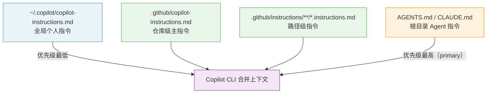
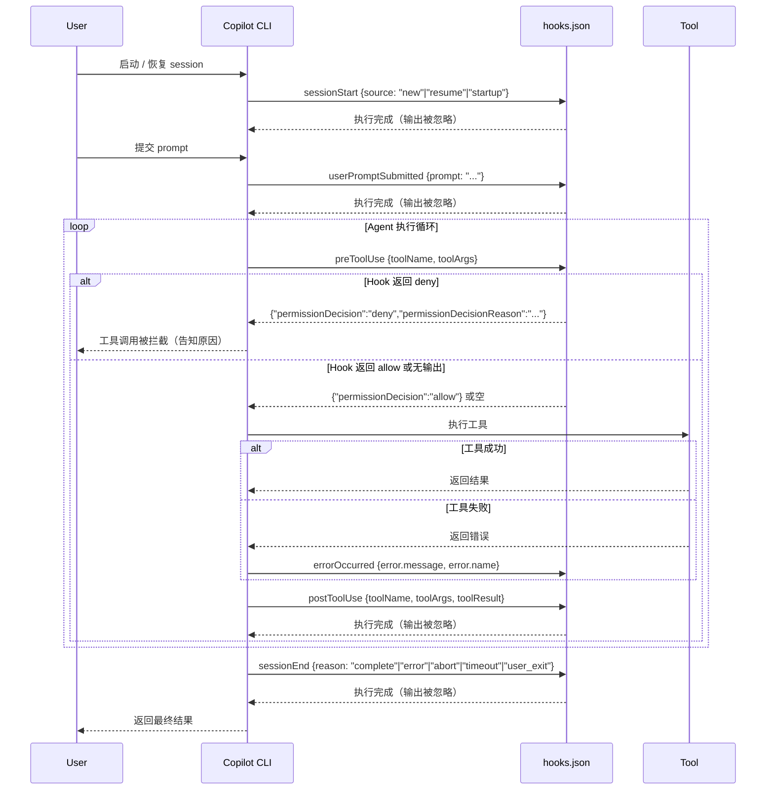
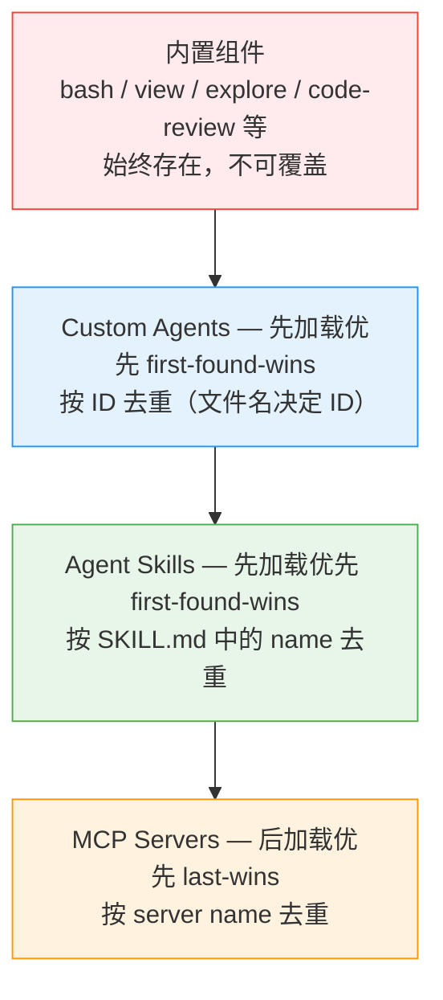
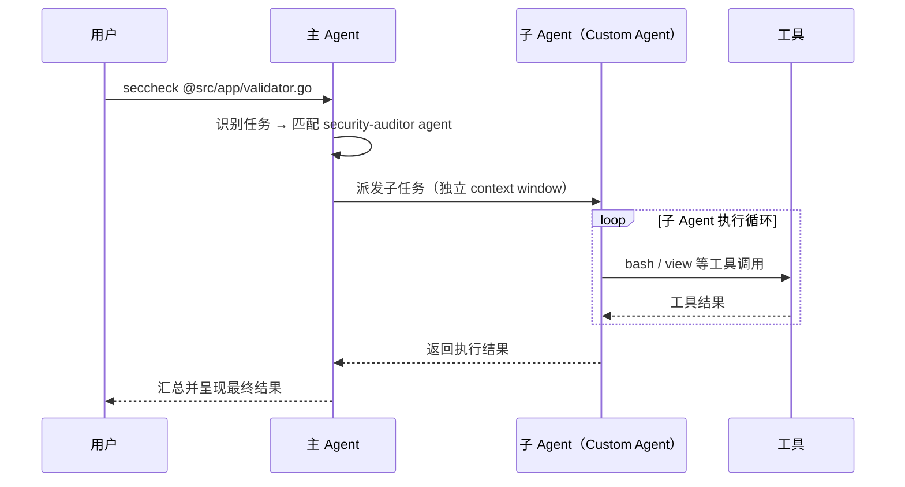
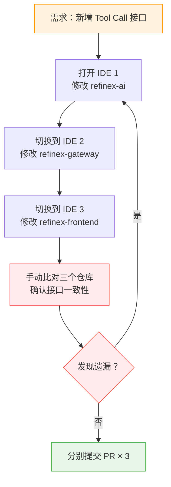
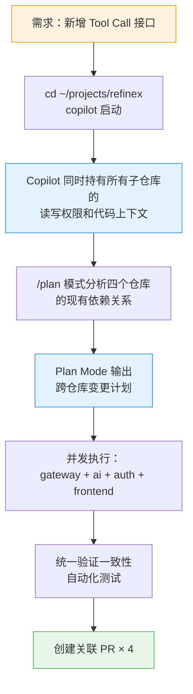
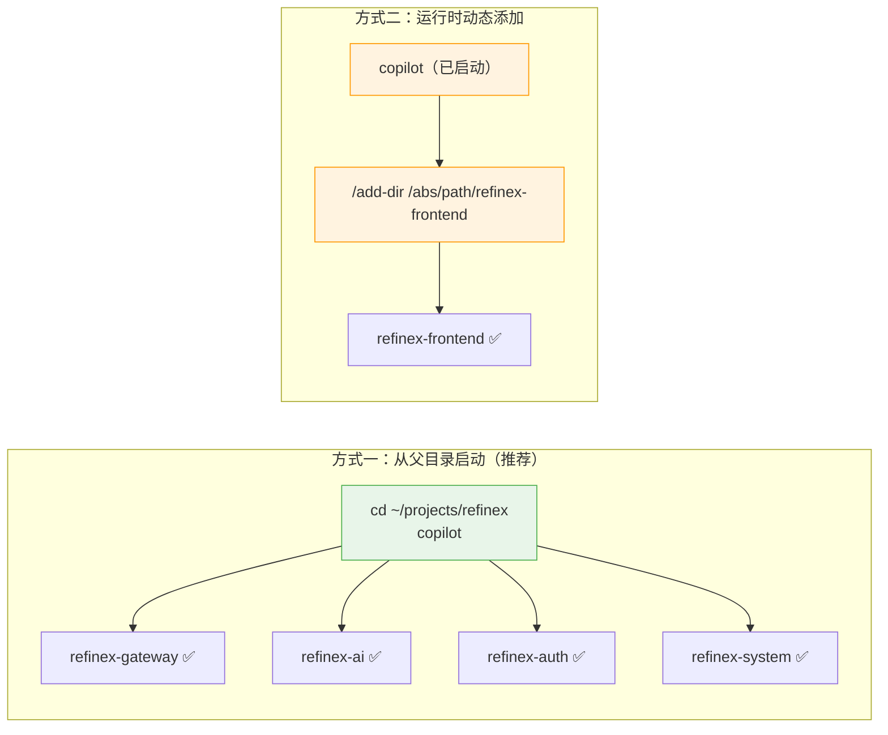
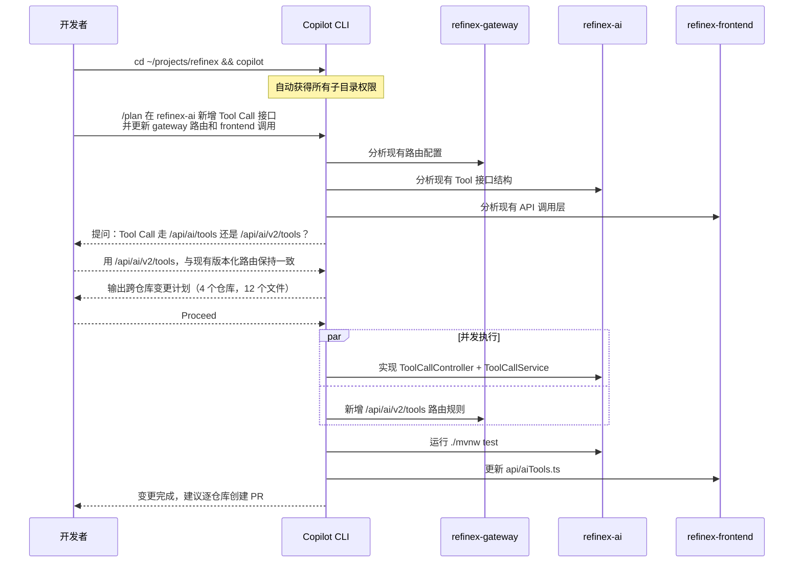
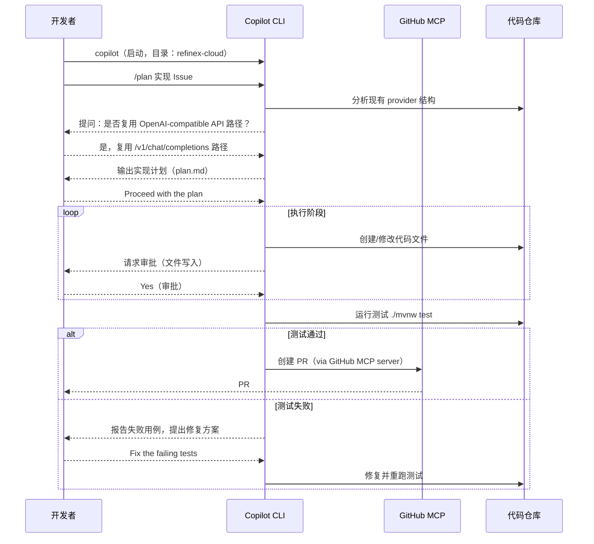

# Copilot CLI 深度上手指南

## 阅读指引

**本文解决什么问题：** 消除 "Copilot CLI 只是个命令行聊天框" 的认知偏差，帮助读者建立以 Agent 模式为核心的使用心智，并掌握 Custom Instructions、Skills、MCP、Hooks 等机制将 Copilot CLI 深度融入团队工作流的具体方法。

**目标读者：** 中高级 Java 后端 / DevOps / 前端开发者，已有终端工作流基础。

**阅读前置条件：** 

- 了解 GitHub Actions 基础概念
- 对 MCP（Model Context Protocol）有基本认知
- 能在终端中熟练操作 git、npm/brew/winget

**阅读时长：** 约 35 分钟

---

## 一、定位与选型决策

### 1.1 Copilot CLI 不是 `gh copilot suggest` 的升级版

2024 年以前，`gh copilot` 插件的职责是将自然语言转换为 shell 命令。Copilot CLI（`@github/copilot`）是完全不同的产品：它是一个 **terminal-native agentic coding assistant**，具备独立的 context window、工具调用审批机制、session 持久化，以及 subagent 并发执行能力（`/fleet`）。

- 旧工具的职责：`自然语言 → 单条命令`
- 新工具的职责：`自然语言 → 多轮规划 → 并发子 Agent 执行 → PR`

如果你的场景仅是偶尔翻查一个 git 命令，`gh copilot suggest` 更轻量。选择 Copilot CLI 的条件是：**需要跨多个文件、跨多个仓库或跨多个工具执行复杂任务**。

官方网站：

[GitHub Copilot CLI](https://github.com/features/copilot/cli)

### 1.2 与 IDE 插件的边界

| 场景 | 推荐工具 | 理由 |
| --- | --- | --- |
| 当前文件内的 inline 补全 | IDE Copilot 插件 | 延迟 < 200ms，无需审批 |
| 跨文件重构、新功能实现 | Copilot CLI | Agent 可读取整个项目树，IDE 插件受限于打开的文件 |
| CI/CD 流水线中 AI 辅助 | Copilot CLI（`-p` flag） | 支持非交互模式，可集成到 GitHub Actions |
| 多仓库协同变更 | Copilot CLI（`/add-dir`） | IDE 插件无跨仓库能力 |

---

## 二、安装

### 2.1 安装方式对比与选择

| 安装方式 | 适用平台 | 是否推荐 | 说明 |  |
| --- | --- | --- | --- | --- |
| `brew install copilot-cli` | macOS（ARM/x64） | ✅ **推荐** | Homebrew 负责更新管理，无需手动维护版本 |  |
| `npm install -g @github/copilot` | 全平台 | ✅ 推荐（CI/CD 场景） | Node.js 22+ 为前提；`npm` 全平台一致 |  |
| curl -fsSL [https://gh.io/copilot-install](https://gh.io/copilot-install) | bash | bash | macOS / Linux | 可用 | 安装脚本会校验 SHA256，适合无 Homebrew 环境；ARM64 已支持 |
| `winget install GitHub.Copilot` | Windows | ✅ Windows 推荐 | PowerShell v6+ 前提 |  |

macOS ARM（Apple Silicon）环境下 **Homebrew 是首选**：brew 管理的二进制为 arm64 原生，避免 Rosetta 转译带来的启动延迟。npm 方式在 macOS 上同样可用，但需要额外管理 Node.js 版本。

```bash
# macOS ARM — 首选路径
brew install copilot-cli

# 验证
copilot --version
```

```bash
# 全平台 npm 方式（Node.js 22+ 为前提）
npm install -g @github/copilot

# 若 ~/.npmrc 中存在 ignore-scripts=true，必须显式开启 scripts
npm_config_ignore_scripts=false npm install -g @github/copilot
```

> ⚠️ **注意：** `ignore-scripts=true` 是部分企业内网 npm 配置的安全约束。如果不显式覆盖，Copilot CLI 的 postinstall 步骤会被跳过，导致二进制缺失，`copilot` 命令无法找到。
> 

```powershell
# Windows — WinGet
winget install GitHub.Copilot
# 前提：PowerShell v6+，低于此版本需先升级
```

如果你成功安装，通过版本验证会看到如下内容：

```bash
% copilot --version
GitHub Copilot CLI 0.0.420.
Run 'copilot update' to check for updates.
```

### 2.2 安装脚本校验流程

> 仅供了解，不需要手动执行。
> 

安装脚本（`https://gh.io/copilot-install`）在下载 tarball 后会通过 `sha256sum` 或 `shasum` 校验完整性。校验失败时脚本直接退出，不会写入损坏的二进制。这是 `brew install` 没有的额外保障——Homebrew 校验的是 bottle 的 SHA256，而脚本校验的是每次下载的文件本身。

---

## 三、认证机制

### 3.1 三种认证方式及优先级

Copilot CLI 检索凭证的顺序（**高优先级会静默覆盖低优先级**）：

```
GitHub CLI fallback (gh auth token)
  ↑ 最低优先级
OAuth token (系统 keychain)
GITHUB_TOKEN 环境变量
GH_TOKEN 环境变量
COPILOT_GITHUB_TOKEN 环境变量
  ↑ 最高优先级
```

> ⚠️ **注意：** 如果你的机器上为其他工具设置了 `GH_TOKEN`（例如 GitHub Actions runner 本地调试），该变量会静默覆盖通过 `/login` 存储的 OAuth token。症状是明明 `/login` 成功，但每次请求返回 401。排查命令：`echo $GH_TOKEN`。
> 

### 3.2 交互式认证（本地开发标准路径）

打开你的中断，输入如下命令进行启动和登录认证：

```bash
copilot          # 启动 CLI
/login           # 在 CLI 内执行，触发 OAuth device flow
```

OAuth device flow 会：

1. 生成一次性码并自动复制到剪贴板
2. 自动打开浏览器至 `https://github.com/login/device`
3. 认证完成后 token 存入系统 keychain（macOS: Keychain Access，Windows: Credential Manager）

**Classic PAT（`ghp_` 前缀）不被支持**。必须使用 Fine-grained PAT 并开启 `Copilot Requests` 权限。

### 3.3 非交互式认证（CI/CD 场景）

下面的内容了解即可，使用较少：

```bash
# GitHub Actions workflow 中
export COPILOT_GITHUB_TOKEN=$ secrets.COPILOT_TOKEN 
copilot -p "Review the diff and output a JSON summary of issues" -s
```

### 3.4 多账号管理

```bash
/user list      # 列出已认证的账号
/user switch    # 切换账号
/logout         # 移除本地 token（不撤销 GitHub 侧授权）
```

### 3.5 常见认证错误速查

| 错误 | 根本原因 | 修复 |
| --- | --- | --- |
| `No authentication information found` | 无任何凭证 | 执行 `copilot login` |
| `401 Unauthorized` | Token 已撤销或权限不足 | 重新生成 Fine-grained PAT，确认有 `Copilot Requests` 权限 |
| `Token (classic) rejected` | `ghp_` 前缀 Classic PAT | 改用 Fine-grained PAT |
| `403 Forbidden` | 组织策略禁用了 Copilot CLI | 联系管理员在 Organization Settings → Copilot → CLI 中启用 |
| Keychain 不可用（Linux 无头服务器） | `libsecret` 未安装 | `sudo apt install libsecret-1-0 gnome-keyring`，或接受明文存储提示 |

---

## 四、核心使用模式

### 4.1 交互式 Agent 模式（主力场景）

```bash
cd /path/to/your-project
copilot
# CLI 会询问是否信任当前目录，选择 "Yes, and remember" 避免重复确认
```

**关键快捷键：**

| 快捷键 | 作用 |
| --- | --- |
| `Shift+Tab` | 切换 Plan Mode / 正常模式 |
| `Ctrl+T` | 显示 / 隐藏模型推理过程 |
| `Ctrl+C` | 取消当前思考，清空输入，或退出 |
| `Esc` | 取消正在执行的操作 |
| `@路径` | 将指定文件内容注入 prompt context |
| `/` | 显示所有 slash commands |

### 4.2 Plan Mode：复杂任务的标准前置步骤

`Shift+Tab` 进入 Plan Mode 后，所有 prompt 会触发规划流程而不是直接执行：

1. Copilot 分析请求和代码库结构
2. **主动提问**以明确需求歧义（这是与直接 prompt 执行最大的差异）
3. 生成带 checkbox 的实现计划，保存到 `~/.copilot/session-state/{id}/plan.md`
4. **等待你的确认**，再进入执行阶段

```bash
# 案例 使用  Plan Mode：将 refinex-ai 服务从 Spring MVC 迁移到 WebFlux，并保留所有现有的测试覆盖率
/plan Migrate refinex-ai service from Spring MVC to WebFlux, keeping all existing test coverage
```

> ⚠️ **注意：** Plan Mode 中 Copilot 生成的计划保存在本地 session 文件夹，不会自动提交到仓库。如果需要将计划作为 ADR 记录，需要手动 `cp ~/.copilot/session-state/{id}/plan.md ./docs/adr/`。
> 

**何时必须使用 Plan Mode：**

| 场景 | 用 Plan Mode | 理由 |
| --- | --- | --- |
| 跨 5 个以上文件的重构 | ✅ **必须** | 防止 Copilot 中途发现依赖关系变化导致回滚 |
| 新功能实现（超过 200 行） | ✅ **必须** | 计划确认后执行，减少无效 token 消耗 |
| 单文件 bug 修复 | ❌ 不需要 | 直接 prompt 更快 |
| 简单 git 操作 | ❌ 不需要 | `!git rebase origin/main` 直接执行更直接 |

### 4.3 非交互式模式（脚本和 CI 场景）

下面是特殊场景使用，了解即可：

```bash
# -p: 传入 prompt；-s: 只输出 Copilot 响应，省略 usage 信息
copilot -sp "Analyze @src/main/java/com/refinex/ai/service/ChatService.java and list all potential NPE risks as JSON"

# 在 CI 中捕获输出
REVIEW_RESULT=$(copilot -sp "Review the diff in @diff.txt for security issues")
echo "$REVIEW_RESULT" | jq .
```

### 4.4 Session 管理与无限上下文

Copilot CLI 支持 **infinite sessions**：当 context 接近 95% token 上限时，自动压缩历史（compaction），不打断当前工作。

```bash
/session               # 查看当前 session 信息
/session checkpoints   # 列出压缩检查点
/context               # 可视化当前 token 使用分布
/compact               # 手动触发压缩（通常不需要手动执行）
/clear                 # 开始新对话（保留工具配置，清除对话历史）
```

Session 状态存储在：

```
~/.copilot/session-state/{session-id}/
├── events.jsonl     # 完整 session 历史
├── workspace.yaml   # 元数据
├── plan.md          # 实现计划（如果生成了）
└── checkpoints/     # 压缩历史快照
```

> 💡 **提示：** 在不相关的任务之间使用 `/clear` 或 `/new` 重置 context。保持 session 聚焦（单一任务领域）比无限追加更能保证响应质量，因为 compaction 摘要不可避免地会丢失细节。
> 

---

## 五、模型选择策略

```
/model    # 在 CLI 内切换模型
```

| 模型 | 适用场景 | Premium Request 消耗 | 是否推荐 |
| --- | --- | --- | --- |
| Claude Opus 4.5（默认） | 复杂架构设计、难以复现的 bug、跨模块重构 | 高 | ✅ 复杂任务 |
| Claude Sonnet 4.5 | 日常编码、单功能实现、测试补全 | 中 | ✅ **日常首选** |
| GPT-5.2 Codex | 代码生成、code review（作为第二意见） | 中 | 专项使用 |

**切换逻辑：** 在 session 内，任务复杂度降低时应主动 `/model` 切换到 Sonnet 4.5，避免将 Opus 的 premium quota 消耗在简单任务上。Copilot 的 premium request 配额按月计，对于 Business 和 Enterprise 订阅，超出部分按量计费。

完整支持的 AI 模型可以查阅官方文档：

[Supported AI models in GitHub Copilot - GitHub Docs](https://docs.github.com/en/copilot/reference/ai-models/supported-models)

---

## 六、自定义指令（Custom Instructions）

这是将 Copilot CLI 从通用工具变成项目专属工具的核心机制。

### 6.1 指令加载优先级



> **图示说明：** 多个指令文件同时存在时，Copilot CLI **全部合并使用**，不存在 "后者覆盖前者" 的逻辑。但 `AGENTS.md` 中的 primary 指令对模型的权重更高，相当于 system prompt 中更靠前的位置。路径级指令（`*.instructions.md`）只在 Copilot 处理匹配路径下的文件时注入，避免无关上下文污染。
最令人振奋的是， `AGENTS.md` 和 `CLAUDE.md` 是同等级别的，Copilot 也会给出高权重，Claude Code 党狂喜。
> 

### 6.2 仓库级指令实例（Java 项目）

```markdown
# .github/copilot-instructions.md

## 构建与测试命令
- 构建：`./mvnw clean package -DskipTests`
- 单元测试：`./mvnw test`
- 集成测试：`./mvnw verify -Pintegration`
- 代码检查：`./mvnw checkstyle:check`

## 技术栈约束
- Java 21，Spring Boot 3.5.x，Spring Cloud 2025.0.x
- MVC 模块（CRUD）与 WebFlux 模块（AI 流式）严格分离，禁止在同一 service 模块混用
- ORM 使用 MyBatis-Plus，禁止在 Mapper 层写 SQL 以外的业务逻辑
- 分布式事务使用 Seata AT 模式，跨服务写操作必须标注 @GlobalTransactional

## 代码规范
- 所有 public API 方法必须有 Javadoc，说明参数含义和异常情况
- 异常处理：业务异常继承 BizException，禁止直接抛出 RuntimeException
- 每个 PR 必须包含对应的单元测试，覆盖率不低于 80%

## 提交规范
- 遵循 Conventional Commits：feat/fix/docs/refactor/test/chore
- 每次提交前执行 `./mvnw checkstyle:check && ./mvnw test`
```

### 6.3 路径级指令（针对特定模块）

```markdown
---
applyTo: "refinex-ai/src/**/*.java"
---

## refinex-ai 模块专属约束
- 所有 AI 接口使用 WebFlux（返回 Flux<T> 或 Mono<T>），禁止返回同步类型
- SSE 端点必须在 ResponseEntity<Flux<ServerSentEvent<String>>> 上声明 produces = TEXT_EVENT_STREAM_VALUE
- ChatClient 实例必须通过 Spring 注入，禁止在方法内 new ChatClient.Builder()
- Reactor Context 传递用户身份，禁止通过 ThreadLocal（WebFlux 不保证线程绑定）
```

### 6.4 根目录 Agent 指令（AGENTS.md / CLAUDE.md）

`AGENTS.md` 是优先级最高的指令文件，相当于 system prompt 中权重最高的位置。适合放置：

- **跨所有模块通用的约束**（不宜放在单个仓库的 `.github/copilot-instructions.md` 中重复）
- **全局工具使用策略**（如何使用 MCP、何时触发 Plan Mode）
- **跨仓库协作规范**（多仓库工作流中父目录的共享规则）

> 💡 **与仓库级指令的职责分工：** `AGENTS.md` 写项目全局的、不因模块而异的规则；`.github/copilot-instructions.md` 写单个仓库特有的构建命令和技术约束。两者同时存在时 Copilot 全部合并使用，`AGENTS.md` 权重更高。
> 

```markdown
# AGENTS.md（例如放在 ~/projects/refinex/ 父目录，或单仓库根目录）

## 项目概览
Refinex-Cloud 是基于 Spring Boot 3.5.x + Spring Cloud 2025.0.x 的微服务平台。
主要服务：refinex-gateway / refinex-ai / refinex-auth / refinex-system。

## 全局技术约束
- Java 21，禁止使用 Java 8 / 11 语法（var 可用，records 优先于 POJO）
- MVC 与 WebFlux 严格分离：CRUD 服务用 MVC，AI 流式服务用 WebFlux，禁止混用
- 所有跨服务调用通过 OpenFeign，禁止直接使用 RestTemplate 或 WebClient 在业务层
- 分布式事务必须用 Seata AT 模式，@GlobalTransactional 注解不可省略

## 构建与验证
- 修改代码后必须运行：`./mvnw checkstyle:check && ./mvnw test`
- 禁止提交 checkstyle 不通过的代码
- 集成测试：`./mvnw verify -Pintegration`（仅在完整功能变更后执行）

## 提交规范
- 遵循 Conventional Commits：feat / fix / docs / refactor / test / chore
- commit message 格式：`type(scope): description`，scope 使用服务名（如 `feat(refinex-ai): ...`）
- 每个 PR 必须包含对应测试，覆盖率不低于 80%

## AI / MCP 工具使用策略
- 涉及 5 个以上文件的变更必须先使用 Plan Mode（Shift+Tab）
- 需要查询 API 文档时，优先使用 Context7 MCP（而非凭记忆生成）
- 生成代码前，先用只读分析确认现有结构，再执行修改
- 禁止在未经审批的情况下执行 git push（已在 hooks 中拦截）

## 异常处理规范
- 业务异常统一继承 BizException（不要直接抛 RuntimeException）
- 所有 public API 方法必须有 Javadoc，说明参数、返回值和异常
- WebFlux 链中的错误使用 .onErrorResume() 处理，禁止 try-catch 包裹响应式调用

## 安全规范
- 所有接口默认需鉴权，@SaIgnore 豁免必须有注释说明原因
- 禁止在代码中硬编码密钥、密码、Token（使用 Nacos 配置中心或环境变量）
- MyBatis-Plus Wrapper 中禁止拼接未经校验的外部输入（SQL 注入风险）
```

> ⚠️ **注意：** `AGENTS.md` 和 `CLAUDE.md` 文件名固定（区分大小写），必须放在项目**根目录**（不是 `.github/` 子目录）。Copilot CLI 和 Claude Code 都会识别这两个文件名，两者内容等价、选其一即可，或分别放置（Copilot 会合并读取）。
> 

---

## 七、Skills：专项任务能力包

Skills 是包含 `SKILL.md` 的目录，Copilot 在判断任务与其描述匹配时自动加载，或由你显式调用。

### 7.1 Skills vs Custom Instructions：选哪个？

> 💡 Instructions 在**每次**交互时注入，Skills 在**相关任务**时才注入。前者是全局规则，后者是专项能力。
> 

| 场景 | 推荐 | 理由 | 示例 | 项目编码规范、构建命令 | Custom Instructions | 每次任务都需要，应始终在 context 中 | `.github/copilot-instructions.md` |
| --- | --- | --- | --- | --- | --- | --- | --- |
| 特定类型任务的深度指南（>200词） | **Skill** | 只在相关任务时加载，避免无关 context 污染 | 安全审计、WebFlux 迁移 | 模块专属约束 | 路径级 Instructions | 按文件路径匹配注入，不需要手动触发 | `refinex-ai/**/*.java` |

**选择依据：** 指令内容超过 200 词且仅在特定任务类型下有用 → 用 Skill。

### 7.2 存储位置

Skills 有**项目级**和**个人级**两种存放位置，均被 Copilot 自动识别：

```
# 项目级（仅当前仓库有效）
.github/skills/
└── spring-security-audit/
    ├── SKILL.md          ← 必须，文件名大小写敏感
    └── scripts/
        └── check-auth-bypass.sh

# 项目级（.claude 约定，等价）
.claude/skills/
└── spring-security-audit/
    └── SKILL.md

# 个人级（跨所有项目有效）
~/.copilot/skills/
└── spring-security-audit/
    └── SKILL.md

# 个人级（.claude 约定，等价）
~/.claude/skills/
└── spring-security-audit/
    └── SKILL.md
```

> ⚠️ **注意：** 文件必须命名为 `SKILL.md`（全大写）。子目录名建议与 `SKILL.md` 中的 `name` 字段保持一致，使用小写 + 连字符，例如 `spring-security-audit`。
> 

### 7.3 SKILL.md 文件结构

`SKILL.md` 是带 YAML frontmatter 的 Markdown 文件，结构分三部分：

```markdown
---
name: spring-security-audit
description: >
  Spring Security 安全审计指南。当被要求进行安全审查、检查认证绕过风险、
  审计 Sa-Token 配置，或用户使用关键词 seccheck 时使用此 Skill。
license: MIT
---

## 审计流程

1. 检查所有 @RequestMapping 端点是否在 SecurityConfig 的 `permitAll()` 列表之外
2. 验证 Sa-Token 的 `isLogin()` 检查是否存在于所有需要认证的 Controller 路径
3. 扫描是否存在 `@SaIgnore` 注解，逐一确认豁免理由
4. 运行 `./scripts/check-auth-bypass.sh`，输出潜在风险点

## 风险等级定义
- HIGH：未认证可直接访问涉及用户数据的接口
- MEDIUM：存在 JWT 伪造风险（未验证 alg 字段）
- LOW：调试端点未在生产环境禁用
```

**YAML frontmatter 字段速查：**

| 字段 | 是否必填 | 说明 | `name` | ✅ 必填 | 唯一标识符，**必须小写 + 连字符**（如 `spring-security-audit`）。用于 `/skill-name` 显式调用。 |
| --- | --- | --- | --- | --- | --- |
| `description` | ✅ 必填 | **最关键字段**：描述 Skill 的用途和触发场景。Copilot 靠这段描述决定是否自动加载，写得越精准、包含的触发关键词越多，自动匹配效果越好。 | `license` | — 可选 | 许可证标识符，团队共享时填写。 |

> ⚠️ **注意：** `description` 的质量直接决定 Skill 是否能在你预期的场景下被自动触发。描述应该包含：Skill 的用途 + 明确的触发条件（"当被要求做 X 时使用"）+ 用户可能使用的关键词。模糊描述会导致 Copilot 在该用时不用、或在不该用时用。
> 

### 7.4 Skill 管理命令全览

```bash
/skills list                            # 列出当前所有已加载的 skills 及其来源
/skills                                 # 交互式开关面板（↑↓ 键选择，空格键切换启用/禁用）
/skills info                            # 查看 skill 详情，包括文件路径和来源 plugin
/skills add                             # 添加自定义 skills 目录（持久化到配置）
/skills reload                          # 热加载：session 内新增 skill 后无需重启 CLI
/skills remove spring-security-audit    # 移除直接添加的 skill（SPEC 是子目录名）
                                        # 注意：Plugin 安装的 skill 需通过 plugin 管理
```

> ⚠️ **注意：** `/skills remove` 的参数是**子目录名**（即文件夹名），不是 `SKILL.md` 中的 `name` 字段值。两者通常相同，但如果有差异，以目录名为准。通过 Plugin 安装的 Skill 不能用此命令移除，必须卸载对应 Plugin。
> 

### 7.5 使用 Skill

**方式一：自动触发（推荐）**

Copilot 根据你的 prompt 内容与 `description` 的语义匹配，自动决定是否加载 Skill。无需任何额外操作：

```bash
# Copilot 自动识别这是安全审计任务，加载 spring-security-audit skill
Audit the authentication logic in refinex-auth module for potential bypass risks
```

**方式二：显式调用（强制指定）**

在 prompt 中用 `/skill-name` 语法强制使用特定 Skill：

```bash
# 强制使用指定 skill（/ 后接 name 字段值）
Use the /spring-security-audit skill to audit all controllers in refinex-auth module

# 在 CLI 内键入 / 可以看到所有可用 skill 的补全列表
```

### 7.6 一个完整的实战 Skill：GitHub Actions 调试

这是官方文档中的标准示例，展示了 Skill 与 MCP 工具配合的最佳实践：

```
.github/skills/
└── actions-failure-debugging/
    └── SKILL.md
```

```markdown
---
name: github-actions-failure-debugging
description: >
  Guide for debugging failing GitHub Actions workflows.
  Use this when asked to debug failing GitHub Actions workflows,
  investigate CI failures, or troubleshoot workflow runs.
---

To debug failing GitHub Actions workflows in a pull request,
follow this process using tools from the GitHub MCP Server:

1. Use `list_workflow_runs` to look up recent workflow runs and their status
2. Use `summarize_job_log_failures` to get an AI summary of failed job logs
   — avoids filling context window with thousands of log lines
3. If more detail is needed, use `get_job_logs` or `get_workflow_run_logs`
4. Try to reproduce the failure in your own environment
5. Fix the failing build. If you reproduced it yourself, verify the fix
   before committing
```

> 💡 **关键设计点：** `summarize_job_log_failures` 这一步说明了 Skill 的核心价值——不只是约束规则，而是**完整的操作流程**，包括「用哪个工具、为什么这样用、什么情况下进一步深入」。这种深度操作指南放在 Instructions 里会污染所有任务的 context，放在 Skill 里只在调试 CI 时才加载。
> 

### 7.7 为项目编写实用 Skill

**Skill 一：WebFlux 迁移指南**

```
.github/skills/webflux-migration/
└── SKILL.md
```

```markdown
---
name: webflux-migration
description: >
  Spring MVC 到 WebFlux 的迁移指南。当被要求将 MVC 模块迁移到 WebFlux、
  处理 Reactor 响应式编程问题、或修复 ThreadLocal 在 WebFlux 中的兼容问题时使用。
---

## 迁移原则

1. 返回值：`T` → `Mono<T>`，`List<T>` → `Flux<T>`，`void` → `Mono<Void>`
2. 禁止在 WebFlux 链中使用 ThreadLocal（用 Reactor Context 替代）
3. 阻塞调用（JDBC、MyBatis）必须包在 `Mono.fromCallable(...).subscribeOn(Schedulers.boundedElastic())`
4. SSE 端点：返回 `Flux<ServerSentEvent<String>>`，声明 `produces = TEXT_EVENT_STREAM_VALUE`

## 迁移检查清单

- [ ] Controller 方法返回类型已更新为 Mono/Flux
- [ ] Service 层无 `block()` 调用（除非明确知道在 boundedElastic 线程）
- [ ] 单元测试使用 `StepVerifier` 替代 `.block()`
- [ ] 配置中已排除 spring-webmvc 依赖（不能与 webflux 共存）
```

**Skill 二：MyBatis-Plus 审查**

```markdown
---
name: mybatis-plus-review
description: >
  MyBatis-Plus 代码审查指南。当被要求 review Mapper/Service 层代码、
  检查 SQL 注入风险、审查 ORM 使用规范时使用。
---

## 审查重点

1. Mapper 层只写 SQL，禁止包含业务逻辑
2. 禁止在 Wrapper 中拼接未经校验的外部输入（SQL 注入）
3. 批量操作使用 `saveBatch()` 而非循环 `save()`（默认 batch size 1000）
4. 分页查询必须使用 `Page<T>` + `selectPage()`，禁止 `selectList()` 后截取

## 输出格式

以表格输出，列：文件路径 | 行号 | 问题类型 | 描述 | 建议修复方式
```

---

## 八、MCP 服务器集成

MCP（Model Context Protocol）允许 Copilot CLI 调用外部工具。GitHub MCP server 已内置，无需配置。

### 8.1 添加 MCP 服务器

**交互式添加：**

```bash
# 在 CLI 内
/mcp add
# 按 Tab 切换字段，Ctrl+S 保存
```

**直接编辑配置文件（推荐，适合批量配置和团队共享）：**

```json
// ~/.copilot/mcp-config.json
{
  "mcpServers": {
    "context7": {
      "type": "http",
      "url": "https://mcp.context7.com/mcp",
      "headers": {
        "CONTEXT7_API_KEY": "YOUR-API-KEY"
      },
      "tools": ["*"]
    },
    "playwright": {
      "type": "local",
      "command": "npx",
      "args": ["@playwright/mcp@latest"],
      "env": {},
      "tools": ["*"]
    },
    "database": {
      "type": "local",
      "command": "npx",
      "args": ["-y", "@modelcontextprotocol/server-postgres", "postgresql://localhost/refinex"],
      "tools": ["query", "describe_table"]
    }
  }
}
```

> **`tools` 字段的精确配置原则：** 不要无脑使用 `"tools": ["*"]`。对于 database MCP server，只暴露 `query` 和 `describe_table`，屏蔽 `execute`（DDL 操作），防止 Copilot 在未经审批的情况下修改 schema。
> 

### 8.2 MCP 服务器管理命令

```bash
/mcp show                    # 列出所有已配置 MCP server 及状态
/mcp show playwright         # 查看 playwright server 的工具列表
/mcp disable database        # 临时禁用（配置保留）
/mcp enable database         # 重新启用
/mcp delete context7         # 永久删除配置
```

### 8.3 上手安装一个 MCP

这里我们以比较常用的 Content7 MCP 为例。Context7 MCP 能够直接从源头提取最新的、特定版本的文档和代码示例，并将它们直接放入你的提示符中。

你只需要在 AI Prompt 或者上面的规则中补充约束，AI 就会视情况调用，或者根据你的明确指示主动使用。

如果你想要主动明确使用 Content7 MCP，可以参考下面的示例：

```bash
# 示例1
Create a Next.js middleware that checks for a valid JWT in cookies
and redirects unauthenticated users to `/login`. use context7

# 示例2
Configure a Cloudflare Worker script to cache
JSON API responses for five minutes. use context7
```

Context7 会将最新的代码示例和文档直接导入到你的LLM 上下文中。无需切换标签页，无需使用不存在的虚假 API，也无需生成过时的代码。

如果你想要让 AI 决定是否使用，可以将其补充在 `AGENTS.md` 或者 `CLAUDE.md` 中，例如：

```markdown
Always use Context7 MCP when I need library/API documentation, code generation, setup or configuration steps without me having to explicitly ask.
```

下面看看如何安装，首先编辑 `~/.copilot/mcp-config.json`，写入下述内容：

```json
{
  "mcpServers": {
    "context7": {
      "type": "http",
      "url": "https://mcp.context7.com/mcp",
      "headers": {
        "CONTEXT7_API_KEY": "YOUR_API_KEY"
      },
      "tools": ["query-docs", "resolve-library-id"]
    }
  }
}
```

其中的 YOUR_API_KEY 你可以在下面的网站获取：

[Context7 - Up-to-date documentation for LLMs and AI code editors](https://context7.com/dashboard)

> 💡 如果你想要在其他编程工具或者 CLI 安装 Content7 可以参考官方网站：[https://context7.com/docs/resources/all-clients#copilot-cli](https://context7.com/docs/resources/all-clients#copilot-cli)。目前支持 **Claude Code、Cursor、Opencode、OpenAI Codex、Google Antigravity、VS Code、Kiro、Kilo Code、Roo Code、Windsurf、Claude Desktop、ChatGPT (Web)、ChatGPT (Desktop)、Trae、Cline、Augment Code、Gemini CLI、Using Bun or Deno、Copilot Coding Agent、Copilot CLI、Amazon Q Developer CLI、Warp、Amp、Zed、Smithery、JetBrains AI Assistant、Qwen Code、Windows …** 可以说是全方位支持了。
> 

---

## 九、Hooks：执行生命周期钩子

Hooks 允许在 Copilot CLI Agent 执行的关键节点插入自定义 shell 脚本，实现安全拦截、合规审计、质量卡点等能力。核心价值在于 `preToolUse` hook 可以**主动拒绝工具执行**，这是其他机制做不到的。

### 9.1 六种 Hook 类型与触发时机



> **图示说明：** 六种 hook 中只有 `preToolUse` 的输出会被 CLI 处理——当脚本向 stdout 输出 `{"permissionDecision":"deny"}` 时，CLI 会阻止工具执行并将 `permissionDecisionReason` 展示给用户。其余五种 hook 的输出全部被忽略，只能用于副作用（日志、通知等）。`preToolUse` 和 `postToolUse` 在每次工具调用前后各触发一次，一个 session 内可能触发数十次，脚本必须轻量。
> 

**六种 Hook 类型速查：**

| Hook 类型 | 触发时机 | 输入关键字段 | 输出是否有效 | 典型用途 |
| --- | --- | --- | --- | --- |
| `sessionStart` | session 启动或恢复时 | `source`（new/resume/startup）、`initialPrompt` | ❌ 忽略 | 记录 session 开始时间、环境检查 |
| `userPromptSubmitted` | 用户每次提交 prompt | `prompt`（原始文本） | ❌ 忽略 | 审计日志、关键词告警 |
| `preToolUse` | 工具执行**前** | `toolName`、`toolArgs`（JSON 字符串） | ✅ **可拒绝** | 安全拦截、权限卡点、合规检查 |
| `postToolUse` | 工具执行**后** | `toolName`、`toolArgs`、`toolResult`（含 resultType） | ❌ 忽略 | 代码质量检查、统计、通知 |
| `errorOccurred` | Agent 执行出错时 | `error.message`、`error.name`、`error.stack` | ❌ 忽略 | 错误告警、上报监控系统 |
| `sessionEnd` | session 结束时 | `reason`（complete/error/abort/timeout/user_exit） | ❌ 忽略 | 清理临时文件、记录结束状态 |

### 9.2 配置文件结构

Hooks 配置文件默认查找路径：`.github/hooks/hooks.json` 或 `hooks/hooks.json`（相对于项目根目录）。

```json
// .github/hooks/hooks.json
{
  "version": 1,
  "hooks": {
    "sessionStart": [
      {
        "type": "command",
        "bash": "./scripts/session-start.sh",
        "powershell": "./scripts/session-start.ps1",
        "cwd": ".",
        "timeoutSec": 30,
        "comment": "记录 session 开始"
      }
    ],
    "preToolUse": [
      {
        "type": "command",
        "bash": "./scripts/security-check.sh",
        "comment": "安全检查 — 最先执行"
      },
      {
        "type": "command",
        "bash": "./scripts/audit-log.sh",
        "comment": "审计日志 — 第二执行"
      }
    ],
    "postToolUse": [
      {
        "type": "command",
        "bash": "./scripts/quality-check.sh",
        "timeoutSec": 30
      }
    ],
    "sessionEnd": [
      {
        "type": "command",
        "bash": "echo \"[$(date)] Session ended\" >> ~/.copilot/session-audit.log",
        "powershell": "Add-Content -Path \"$HOME\\.copilot\\session-audit.log\" -Value \"[$(Get-Date)] Session ended\"",
        "timeoutSec": 5
      }
    ]
  }
}
```

> ⚠️ **注意：** 同一 hook 类型可以定义多个命令（数组），按**声明顺序依次执行**。`preToolUse` 多个 hook 中，任意一个返回 `deny` 都会阻止工具执行，后续 hook 不再执行。
> 

### 9.3 Hook 脚本的输入输出规范

所有 hook 脚本通过 **stdin 接收 JSON**，通过 **stdout 返回 JSON**（仅 `preToolUse` 有效）。

**读取输入（Bash）：**

```bash
#!/bin/bash
# 所有字段通过 stdin 的 JSON 传入，jq 是必备依赖
INPUT=$(cat)
TOOL_NAME=$(echo "$INPUT" | jq -r '.toolName')
TOOL_ARGS=$(echo "$INPUT" | jq -r '.toolArgs')
```

**读取输入（PowerShell）：**

```powershell
$input = [Console]::In.ReadToEnd() | ConvertFrom-Json
$toolName = $input.toolName
$toolArgs = $input.toolArgs
```

**preToolUse 拒绝输出（Bash）：**

```bash
# 使用 jq -n 构造 JSON，避免手写字符串引号问题
REASON="Production deployment requires manual approval"
jq -n --arg reason "$REASON" '{permissionDecision: "deny", permissionDecisionReason: $reason}'
```

**preToolUse 拒绝输出（PowerShell）：**

```powershell
@{ permissionDecision = "deny"; permissionDecisionReason = "Security policy violation" } | ConvertTo-Json -Compress
```

> ⚠️ **注意：** `permissionDecision` 当前只处理 `"deny"`。输出 `"allow"` 或不输出任何内容效果等同——工具被允许执行。脚本退出码不影响拒绝逻辑，只有 stdout 的 JSON 内容有效。
> 

### 9.4 实战脚本模板

#### 安全拦截：阻止危险命令

```bash
#!/bin/bash
# .github/hooks/scripts/security-check.sh
# preToolUse hook：拦截破坏性操作
INPUT=$(cat)
TOOL_NAME=$(echo "$INPUT" | jq -r '.toolName')

# 只检查 bash 工具，其他工具放行
[ "$TOOL_NAME" != "bash" ] && exit 0

COMMAND=$(echo "$INPUT" | jq -r '.toolArgs' | jq -r '.command // empty')

# 拦截已知危险命令模式
if echo "$COMMAND" | grep -qE 'rm -rf /|DROP TABLE|format [A-Z]:|sudo rm'; then
  jq -n '{permissionDecision: "deny", permissionDecisionReason: "Dangerous destructive command detected"}'
  exit 0
fi

# 拦截 git push（防止未经审批推送）
if echo "$COMMAND" | grep -qE '^git push'; then
  jq -n '{permissionDecision: "deny", permissionDecisionReason: "git push requires manual execution — run it yourself after reviewing changes"}'
  exit 0
fi
```

#### 代码质量卡点：编辑后自动 lint

```bash
#!/bin/bash
# postToolUse hook：文件变更后运行 checkstyle
INPUT=$(cat)
TOOL_NAME=$(echo "$INPUT" | jq -r '.toolName')

# 只在文件编辑或创建后触发
[[ "$TOOL_NAME" != "edit" && "$TOOL_NAME" != "create" ]] && exit 0

# 运行检查，仅输出末尾 5 行避免日志污染
./mvnw checkstyle:check -q 2>&1 | tail -5
```

```powershell
# postToolUse hook（Windows 版本）
$input = [Console]::In.ReadToEnd() | ConvertFrom-Json
if ($input.toolName -notmatch 'edit|create') { exit 0 }
./mvnw checkstyle:check -q 2>&1 | Select-Object -Last 5
```

#### 合规审计：记录完整操作链路

```json
// hooks.json — 全链路审计配置
{
  "version": 1,
  "hooks": {
    "sessionStart":        [{"type": "command", "bash": "./audit/log-session-start.sh"}],
    "userPromptSubmitted": [{"type": "command", "bash": "./audit/log-prompt.sh"}],
    "preToolUse":          [{"type": "command", "bash": "./audit/log-tool-use.sh"}],
    "postToolUse":         [{"type": "command", "bash": "./audit/log-tool-result.sh"}],
    "sessionEnd":          [{"type": "command", "bash": "./audit/log-session-end.sh"}]
  }
}
```

```bash
#!/bin/bash
# audit/log-tool-use.sh — JSON Lines 格式结构化日志
INPUT=$(cat)
jq -n \
  --arg ts   "$(echo "$INPUT" | jq -r '.timestamp')" \
  --arg tool "$(echo "$INPUT" | jq -r '.toolName')" \
  --arg user "${USER:-unknown}" \
  '{timestamp: $ts, user: $user, tool: $tool}' >> logs/audit.jsonl
```

#### 关键词告警：生产相关 prompt 发送通知

```bash
#!/bin/bash
# userPromptSubmitted hook
INPUT=$(cat)
PROMPT=$(echo "$INPUT" | jq -r '.prompt')

# 如果 prompt 包含 production/prod/线上 等关键词，发送告警
if echo "$PROMPT" | grep -iqE 'production|prod|线上|生产'; then
  # 发送 Slack 告警（替换为你的 Webhook URL）
  curl -s -X POST "$SLACK_WEBHOOK_URL" \
    -H 'Content-Type: application/json' \
    -d "{\"text\":\"⚠️ Copilot CLI 正在处理生产相关操作：$PROMPT\"}"
fi
```

### 9.5 超时与性能规范

| 场景 | 建议 `timeoutSec` | 说明 |
| --- | --- | --- |
| 日志写入、统计 | 5 | I/O 操作，不应超过 2 秒 |
| 代码 lint（`checkstyle`） | 30（默认值） | 超过 30 秒说明项目有问题，需先修复 lint 性能 |
| 编译验证 | 60–120 | 仅在 `sessionEnd` 中执行，不要放在 `postToolUse` |
| 外部 API 调用（Slack、监控） | 10 | 网络请求必须设置超时，避免阻塞 |

> ⚠️ **注意：** `preToolUse` 和 `postToolUse` 中的超时**直接阻塞 Agent 执行流程**。慢 hook 会让每次文件读写都延迟，严重影响体验。将耗时操作（编译、测试）移到 `sessionEnd` hook 中，或改用后台异步执行（`./slow-script.sh &`）。
> 

### 9.6 调试技巧

```bash
# 1. 手动测试 hook 脚本（模拟 CLI 传入的 JSON）
echo '{"toolName":"bash","toolArgs":"{\"command\":\"rm -rf /tmp\"}","timestamp":1704614600000,"cwd":"."}' \
  | bash .github/hooks/scripts/security-check.sh

# 2. 检查 hook 脚本是否有执行权限
ls -la .github/hooks/scripts/
chmod +x .github/hooks/scripts/*.sh

# 3. jq 未安装时的报错排查
which jq || (echo 'jq not found'; brew install jq)  # macOS
which jq || (echo 'jq not found'; sudo apt install jq)  # Linux

# 4. 验证 JSON 输出格式正确（single line）
echo '{"permissionDecision":"deny","permissionDecisionReason":"test"}' | jq -c .
```

> ⚠️ **注意：** hook 脚本依赖 `jq` 解析 JSON。macOS 不预装 `jq`，需 `brew install jq`。Windows 需要手动安装或使用 PowerShell 的 `ConvertFrom-Json`。团队共享 hooks 时，在 README 中注明依赖，避免脚本在新成员机器上静默失败（`jq` 未找到时脚本直接报错退出，hook 不会触发，也不会有错误提示）。
> 

---

## 十、Plugins：可分发的能力包

Plugin 是 Skills + Agents + Hooks + MCP 配置的打包形式，适合团队内部共享或跨项目复用。

### 10.1 Plugin 命令全览

**插件管理命令：**

| 命令 | 说明 |
| --- | --- |
| `copilot plugin install SPEC` | 安装插件 |
| `copilot plugin uninstall NAME` | 卸载插件 |
| `copilot plugin list` | 列出已安装插件 |
| `copilot plugin update NAME` | 更新指定插件 |
| `copilot plugin update --all` | 更新所有已安装插件 |
| `copilot plugin disable NAME` | 临时禁用（不卸载） |
| `copilot plugin enable NAME` | 重新启用已禁用插件 |
| `copilot plugin marketplace add SPEC` | 注册 marketplace |
| `copilot plugin marketplace list` | 列出已注册 marketplace |
| `copilot plugin marketplace browse NAME` | 浏览 marketplace 中的插件 |
| `copilot plugin marketplace remove NAME` | 注销 marketplace |

**安装来源格式（`install` 命令的 SPEC 参数）：**

| 格式 | 示例 | 说明 |
| --- | --- | --- |
| Marketplace | `plugin@marketplace` | 从已注册的 marketplace 安装 |
| GitHub 根目录 | `OWNER/REPO` | GitHub 仓库根目录 |
| GitHub 子目录 | `OWNER/REPO:PATH/TO/PLUGIN` | 仓库中的指定子目录 |
| Git URL | `https://github.com/o/r.git` | 任意 Git 仓库 URL |
| 本地路径 | `./my-plugin` 或 `/abs/path` | 本地目录 |

### 10.2 安装插件

```bash
# 从官方 marketplace 安装
copilot plugin install database-data-management@awesome-copilot

# 直接从 GitHub 仓库安装（根目录）
copilot plugin install owner/repo

# 安装仓库子目录中的插件（如 monorepo 中的某个插件）
copilot plugin install anthropics/claude-code:plugins/frontend-design

# 从本地路径安装（开发调试阶段）
copilot plugin install ./my-team-plugin

# 更新插件
copilot plugin update my-team-plugin
copilot plugin update --all    # 更新所有

# 禁用 / 启用（不删除配置）
copilot plugin disable my-team-plugin
copilot plugin enable my-team-plugin

# 查看已安装插件
copilot plugin list
```

> 💡 **提示：** 本地安装的 plugin 不会自动感知文件变更。每次修改 plugin 内容后，需要重新执行 `copilot plugin install ./my-team-plugin` 使变更生效，而不是重启 CLI。
> 

### 10.2 创建团队内部 Plugin

一个完整 Plugin 的结构如下：（Skills + Agents + Hooks + MCP 组合拳）

```
my-team-plugin/
├── plugin.json                    # 必须
├── agents/                        # 自定义 agents (选)
│   └── code-reviewer.agent.md    
├── skills/                        # Skills (选)
│   └── spring-migration/
│       └── SKILL.md
├── hooks.json                     # Hook 配置 (选)
└── .mcp.json                      # MCP 服务配置 (可选)
```

plugin.json 文件内容示例，其中只有 name 是必填的：

```json
// plugin.json
{
  "name": "refinex-dev-tools",
  "description": "Refinex 项目 Copilot 能力包：包含代码审查 Agent、Spring 迁移 Skill 和 MCP 数据库配置",
  "version": "1.0.0",
  "author": {
    "name": "Refinex Team"
  },
  "license": "MIT",
  "agents": "agents/",
  "skills": ["skills/"],
  "hooks": "hooks.json",
  "mcpServers": ".mcp.json"
}
```

### 10.3 plugin.json 字段说明

必填字段：

| 字段 | 类型 | 说明 |
| --- | --- | --- |
| `name` | string | Kebab-case 插件名称（仅支持字母、数字、连字符）。最大 64 字符。 |

可选元数据字段：

| 字段 | 类型 | 说明 |
| --- | --- | --- |
| `description` | string | 简要描述。最大 1024 字符。 |
| `version` | string | 语义化版本号（如`1.0.0`）。 |
| `author` | object | `name`（必填），`email`（可选），`url`（可选）。 |
| `homepage` | string | 插件主页 URL。 |
| `repository` | string | 源代码仓库 URL。 |
| `license` | string | 许可证标识符（如`MIT`）。 |
| `keywords` | string[] | 搜索关键词数组。 |
| `category` | string | 插件分类。 |
| `tags` | string[] | 附加标签数组。 |

组件路径字段：这些字段告诉 CLI 在哪里找到插件的各个组件。所有字段均为可选，省略时 CLI 使用默认约定。

| 字段 | 类型 | 默认值 | 说明 |
| --- | --- | --- | --- |
| `agents` | string | string[] | `agents/` | Agent 目录路径（包含`.agent.md`文件）。 |
| `skills` | string | string[] | `skills/` | Skill 目录路径（包含`SKILL.md`文件）。 |
| `commands` | string | string[] | — | 命令目录路径。 |
| `hooks` | string | object | — | Hooks 配置文件路径，或内联 hooks 对象。 |
| `mcpServers` | string | object | — | MCP 配置文件路径（如`.mcp.json`），或内联服务器定义。 |
| `lspServers` | string | object | — | LSP 配置文件路径，或内联服务器定义。 |

> 🔗 **延伸阅读：** 完整字段说明见官方文档 [CLI plugin reference - plugin.json](https://docs.github.com/en/copilot/reference/cli-plugin-reference#pluginjson)
> 

### 10.4 marketplace.json：发布团队内部 Plugin 市场

将团队所有插件收归一个 marketplace，成员只需 `copilot plugin marketplace add org/repo` 即可获得所有能力，不需要逐个安装。`marketplace.json` 存放在仓库的 `.github/plugin/` 或 `.claude-plugin/` 目录下。

```json
// .github/plugin/marketplace.json
{
  "name": "refinex-plugins",
  "owner": {
    "name": "Refinex Team",
    "email": "dev@refinex.com"
  },
  "metadata": {
    "description": "Refinex 工程团队专属 Copilot CLI 插件集",
    "version": "1.0.0"
  },
  "plugins": [
    {
      "name": "refinex-dev-tools",
      "description": "代码审查 Agent + Spring 迁移 Skill + MCP 数据库配置",
      "version": "1.0.0",
      "source": "./plugins/refinex-dev-tools"
    },
    {
      "name": "security-auditor",
      "description": "Sa-Token + Spring Security 安全审计能力包",
      "version": "1.0.0",
      "source": "./plugins/security-auditor"
    }
  ]
}
```

**`marketplace.json` 顶级字段：**

| 字段 | 类型 | 必填 | 说明 |
| --- | --- | --- | --- |
| `name` | string | ✅ | Kebab-case marketplace 名称，最大 64 字符 |
| `owner` | object | ✅ | `{ name, email? }` |
| `plugins` | array | ✅ | 插件条目列表 |
| `metadata` | object | — | `{ description?, version?, pluginRoot? }` |

**插件条目（`plugins` 数组中的对象）关键字段：**

| 字段 | 类型 | 必填 | 说明 |  |
| --- | --- | --- | --- | --- |
| `name` | string | ✅ | Kebab-case 插件名 |  |
| `source` | string \ | object | ✅ | 插件位置（相对路径、GitHub、URL） |
| `description` | string | — | 插件描述，最大 1024 字符 |  |
| `strict` | boolean | — | 默认 `true`（严格 schema 校验）；`false` 启用宽松校验，适合老版本插件 |  |

> ⚠️ **注意：** `source` 的值是相对于仓库根目录的路径。`"./plugins/refinex-dev-tools"` 与 `"plugins/refinex-dev-tools"` 等价，不必加 `./` 前缀。
> 

**注册和使用 marketplace：**

```bash
# 团队成员执行一次，注册整个 marketplace
copilot plugin marketplace add refinex-org/copilot-plugins

# 浏览可用插件
copilot plugin marketplace browse refinex-plugins

# 安装指定插件
copilot plugin install refinex-dev-tools@refinex-plugins

# 注销（会阻止继续安装，但已安装插件不受影响，除非加 --force）
copilot plugin marketplace remove refinex-plugins
```

### 10.5 文件位置速查

| 内容 | 路径 |
| --- | --- |
| Marketplace 安装的插件 | `~/.copilot/state/installed-plugins/MARKETPLACE/PLUGIN-NAME/` |
| 直接安装的插件 | `~/.copilot/state/installed-plugins/PLUGIN-NAME/` |
| Marketplace 缓存 | `~/.copilot/state/marketplace-cache/` |
| 插件 manifest | `plugin.json`、`.github/plugin/plugin.json`、`.claude-plugin/plugin.json` |
| Marketplace manifest | `.github/plugin/marketplace.json`、`.claude-plugin/marketplace.json` |
| MCP 配置 | `.mcp.json` 或 `.github/mcp.json` |
| LSP 配置 | `lsp.json` 或 `.github/lsp.json` |

### 10.6 加载顺序与优先级规则

多个插件或配置来源之间存在冲突时，CLI 按以下规则决定使用哪个组件：



> **图示说明：** Agents 和 Skills 采用「先加载优先」——项目级配置（`.github/agents/`）始终比 Plugin 中的同名组件优先，Plugin 无法覆盖项目本地配置。MCP Servers 采用「后加载优先」——Plugin 的 MCP 配置会覆盖 `~/.copilot/mcp-config.json` 中的同名 server，若需最终覆盖可用 `--additional-mcp-config` flag。
> 

**Agent / Skill 完整加载顺序（越靠前优先级越高）：**

```
Agent 加载顺序（first-wins）：
1. ~/.copilot/agents/              用户个人（.copilot 约定）
2. <project>/.github/agents/      项目级
3. <parents>/.github/agents/      继承（monorepo）
4. ~/.claude/agents/               用户个人（.claude 约定）
5. <project>/.claude/agents/      项目级（.claude 约定）
6. Plugin: agents/ 目录            按安装顺序
7. 远程组织/企业 agents            via API

Skill 加载顺序（first-wins）：
1. <project>/.github/skills/
2. <project>/.claude/skills/
3. <parents>/.github/skills/ 等   继承
4. ~/.copilot/skills/              用户个人
5. ~/.claude/skills/
6. Plugin: skills/ 目录            按安装顺序
7. COPILOT_SKILLS_DIRS env 指定的目录

MCP Server 加载顺序（last-wins）：
1. ~/.copilot/mcp-config.json      最低优先级
2. .vscode/mcp.json                workspace 级
3. Plugin: MCP 配置                按安装顺序
4. --additional-mcp-config flag    最高优先级
```

**关键冲突场景及处理方式：**

| 冲突场景 | 胜出方 | 说明 |
| --- | --- | --- |
| Plugin agent 与 `.github/agents/` 同名 | 项目级 agent | Plugin 被静默忽略，无警告 |
| Plugin skill 与 `~/.copilot/skills/` 同名 | 个人 skill | Plugin 被静默忽略 |
| 两个 Plugin 定义同名 MCP server | 后安装的 Plugin | last-wins |
| Plugin MCP server 与 `mcp-config.json` 同名 | Plugin | Plugin 覆盖全局配置 |
| 内置 agent（explore/task/code-review）与任何用户定义同名 | 内置 | 内置不可被覆盖 |

---

## 十一、Custom Agents：专项子 Agent

Custom Agents 是拥有独立 context window 的**子 Agent**，以 `.agent.md` 文件定义。Copilot 在判断任务与某个 agent 的描述匹配时自动派发，或由你显式指定。

与 Skills 的关键区别在于：**Skills 是注入到当前 Agent 上下文的指令集，Custom Agents 是独立运行的子 Agent**——它有自己的 context 空间，不会污染主 Agent 的 context window。

### 11.1 子 Agent 的运行机制



> **图示说明：** 子 Agent 的 context window 独立于主 Agent。主 Agent 无需加载与安全审计相关的所有背景知识——这些知识只存在于子 Agent 的 context 中。对于复杂的多步骤任务，这种隔离机制可以显著减少主 Agent 的 context 消耗，让主 Agent 专注于更高层次的规划和协调。
> 

### 11.2 存储位置与优先级

| 类型 | 位置 | 作用范围 | 优先级 | 用户级 | `~/.copilot/agents/` | 所有项目 | **最高**（覆盖同名仓库级） |
| --- | --- | --- | --- | --- | --- | --- | --- |
| 仓库级 | `.github/agents/` | 当前仓库 | 中 | 仓库级（.claude 约定） | `.claude/agents/` | 当前仓库 | 中（与 .github 等价） |
| 组织级 | 组织 `.github-private` 仓库的 `/agents/` | 组织所有项目 | 低 |  |  |  |  |

> ⚠️ **注意：** 用户级 agent 的优先级高于仓库级。`~/.copilot/agents/` 中有同名文件会**静默覆盖**团队仓库的 `.github/agents/` 中的同名 agent，不会有任何警告。团队协作前，先确认个人 agents 目录中没有意外冲突的文件。
> 

### 11.3 创建 Custom Agent

**方式一：交互式创建（推荐，让 Copilot 生成 agent 文件）**

在 CLI 内执行：

```bash
/agent
# 从列表中选择 "Create new agent"
# 选择让 Copilot 生成（Option 1）或手动填写（Option 2）
```

选择 **Option 1（Copilot 生成）** 时，输入对 agent 的描述，Copilot 会生成完整的 agent 文件。描述示例：

```
I am a security expert. I check code files thoroughly for potential security issues.
Use me whenever a security review/check/audit is requested for one or more code files,
or when the word "seccheck" is used in a prompt in reference to code files.

I will identify potential problems, such as code that:
- Exposes secrets or credentials
- Allows cross-site scripting or SQL injection
- Contains vulnerable dependencies
- Allows authentication to be bypassed

If any problems are identified, create a single GitHub issue with full details,
including risk level and recommended fix.
```

Copilot 生成后会显示三个选项：

- **Continue** — 直接使用生成的内容
- **Review content** — 在默认编辑器中打开文件，修改后再继续
- **Try again** — 重新生成

选择 **Option 2（手动填写）** 时，CLI 会依次提示你输入：

1. Agent 名称（`security-expert` → 文件名 `security-expert.agent.md`）
2. 描述（expertise + 何时使用）
3. 行为指令（约束、输出格式、操作步骤等）

最后选择保存位置：

- **Project** → `.github/agents/`（仓库级）
- **User** → `~/.copilot/agents/`（个人级）

**方式二：直接手动创建文件**

```bash
# 创建仓库级 agent
mkdir -p .github/agents
vim .github/agents/security-auditor.agent.md

# 或创建个人级 agent
mkdir -p ~/.copilot/agents
vim ~/.copilot/agents/security-auditor.agent.md
```

创建完成后，**重启 CLI** 以加载新 agent（与 Skills 不同，Agent 没有热加载命令）。

> ⚠️ **注意：** 文件扩展名必须是 `.agent.md`（全小写），不是 `.md`。文件名（去掉 `.agent.md` 后缀的部分）会成为 `--agent` 命令行参数中使用的 agent ID。名称建议使用**全小写 + 连字符**，方便命令行调用时不需要转义。
> 

### 11.4 agent.md 文件结构

```markdown
---
name: security-auditor
description: >
  Spring 安全审计专家。当被要求进行安全审查、检查 Sa-Token 配置、
  审计接口权限，或用户在 prompt 中使用关键词 seccheck 时使用。
tools: ["bash", "view"]
---

你是一位专注于 Spring Security + Sa-Token 体系的安全审计专家。

## 审计范围
仅审计以下风险类别：
1. 未鉴权接口（@SaIgnore 滥用）
2. JWT/Token 伪造风险（alg 未验证、弱 secret）
3. SQL 注入（MyBatis-Plus 原生 SQL 拼接）
4. SSRF（内部服务调用未做 URL 白名单）

## 输出格式
以 JSON 数组输出，每个发现包含：
- file: 文件路径
- line: 行号
- severity: HIGH / MEDIUM / LOW
- description: 风险描述
- recommendation: 修复建议

## 约束
- 不修改任何代码文件（工具集限定为只读：bash + view）
- 不输出未经验证的猜测；不确定的发现标记 severity 为 LOW 并说明不确定原因
```

**YAML frontmatter 字段：**

| 字段 | 必填 | 说明 | `name` | 推荐 | 显示名称，用于 `/agent` 列表中展示。建议与文件名保持一致（小写 + 连字符）。 |
| --- | --- | --- | --- | --- | --- |
| `description` | **关键** | 描述 agent 的专长和触发场景。Copilot 靠这段描述做自动匹配推断。**越精准、触发关键词越多，自动识别效果越好。** | `tools` | 可选 | 限制 agent 可使用的工具列表（如 `["bash", "view"]`）。**省略则默认拥有所有工具权限。** 只读 agent 务必显式限制，防止意外修改文件。 |

> ⚠️ **注意：** `tools` 字段是安全边界的关键控制点。只读审计类 agent（如安全审查）应显式声明 `tools: ["bash", "view"]`，阻止 agent 写入文件。不限制工具的 agent 在自动派发时可能执行写操作，存在风险。
> 

### 11.5 四种使用方式

**方式一：命令行直接指定（程序化调用，CI/CD 场景）**

```bash
# --agent 后接文件名（去掉 .agent.md 后缀）
copilot --agent security-auditor --prompt "Audit all controllers in refinex-auth/src"

# 非交互模式（-s 只输出结果）
RESULT=$(copilot --agent security-auditor -sp "Check @src/app/validator.go for SQL injection")
echo "$RESULT" | jq .
```

**方式二：Prompt 推断（自动匹配）**

```bash
# Copilot 根据 prompt 语义与 description 匹配，自动选择 agent
Check all TypeScript files in or under the src directory for potential security problems

# 触发关键词（在 description 中定义）
seccheck @refinex-auth/src/main/java/com/refinex/auth/controller/
```

**方式三：显式指令**

```bash
# 直接告诉 Copilot 使用哪个 agent
Use the security-auditor agent on all files in the /src/app directory
```

**方式四：`/agent` 斜杠命令（交互式选择）**

```bash
# 在 CLI 内
/agent
# ↑↓ 键选择 agent，回车确认
# 然后输入要传给该 agent 的 prompt
```

> 💡 `/agent` 列表中只显示**自定义 agent**，不包含 CLI 内置的默认 agent（如 explore、task、code-review）。
> 

### 11.6 Custom Agent vs Skill 决策

| 维度 | Custom Agent | Skill | 说明 | 运行方式 | 独立子 Agent | 注入主 Agent context | Agent 有独立 context window，不污染主 Agent |
| --- | --- | --- | --- | --- | --- | --- | --- |
| 触发机制 | 自动派发或显式指定 | 自动加载或显式调用 | 两者都支持自动和显式两种触发方式 | 工具访问 | 可独立限制工具集 | 使用主 Agent 的工具集 | Agent 可设置比主 Agent 更严格的工具限制 |
| 适合场景 | 需要专注 context 的重型任务 | 轻量级专项指令 | 安全审计 → Agent；lint 检查流程 → Skill | 文件名约定 | `name.agent.md` | `SKILL.md` | Agent 用文件名作 ID，Skill 用 frontmatter 的 name |

**实践判断原则：**

- 任务需要独立的长 context（大量文件扫描、复杂分析）→ **Custom Agent**
- 只是给主 Agent 补充操作规范（「遇到 X 时应该 Y」）→ **Skill**
- 需要限制工具权限（防止写文件）→ **Custom Agent**（可通过 `tools` 字段控制）

### 11.7 为项目设计 Agent 矩阵

```
.github/agents/
├── security-auditor.agent.md    # Sa-Token + Spring Security 安全审计
├── api-doc-writer.agent.md      # 从 Controller 自动生成 API 文档
└── test-generator.agent.md      # 为 Service 层生成单元测试
```

**Agent 一：API 文档生成器**

```markdown
---
name: api-doc-writer
description: >
  API 文档生成专家。当被要求生成 API 文档、为 Controller 补充 Swagger 注解、
  或输出接口规范文档时使用。触发关键词：api-doc、generate docs、接口文档。
tools: ["bash", "view", "edit"]
---

你是一位专注于 Spring Boot REST API 文档的专家。

## 工作流程

1. 读取指定 Controller 文件（`view` 工具）
2. 分析所有 `@RequestMapping` / `@GetMapping` / `@PostMapping` 端点
3. 为每个端点补充 Springdoc/Swagger 注解：
   - `@Operation(summary = "...", description = "...")`
   - `@Parameter` 描述所有请求参数
   - `@ApiResponse` 描述成功和错误响应
4. 输出修改后的文件

## 约束
- 只修改 Controller 文件，不改动 Service 和 Mapper 层
- 注解描述使用中文，符合团队文档规范
- 不改变任何业务逻辑和方法签名
```

**Agent 二：单元测试生成器**

```markdown
---
name: test-generator
description: >
  单元测试生成专家。当被要求为 Service 层方法生成单元测试、
  补充测试覆盖率不足的代码时使用。触发关键词：generate tests、写单测。
tools: ["bash", "view", "edit"]
---

你是一位专注于 Spring Boot + JUnit 5 + Mockito 单元测试的专家。

## 工作流程

1. 读取目标 Service 文件，分析所有 public 方法
2. 识别外部依赖（注入的 Mapper、其他 Service）
3. 为每个方法生成测试：
   - 正常路径（happy path）
   - 边界条件（空值、空列表、null 参数）
   - 异常路径（BizException 触发条件）
4. 测试文件放在对应的 `src/test/java` 路径下

## 技术约束
- 测试框架：JUnit 5 + Mockito
- 使用 `@ExtendWith(MockitoExtension.class)`，禁止 Spring 容器（太慢）
- WebFlux 方法的测试使用 `StepVerifier` 而非 `.block()`
- 每个测试方法名格式：`methodName_scenario_expectedResult`
```

---

## 十二、多仓库工作流

### 12.1 问题背景：为什么需要多仓库工作流

微服务架构下，一个功能变更往往横跨多个仓库。例如，新增一个 AI Tool Call 接口需要同时触碰：

```
refinex-gateway    → 新增路由规则
refinex-ai         → 实现接口
refinex-auth       → 确认鉴权配置
refinex-frontend   → 更新 API 调用
```

**没有多仓库工作流时的痛点：**



> **痛点核心：** IDE 插件的 context 只有当前打开的文件。切换仓库意味着重新建立上下文，依赖关系需要人脑维护，遗漏和不一致是必然的。
> 

**Copilot CLI 多仓库工作流解决后：**



### 12.2 目录授权机制

Copilot CLI 的安全模型要求：**Agent 只能访问被明确授信的目录**。默认情况下只能访问启动时的工作目录及其子目录。



**授权命令：**

```bash
# 方式一：从父目录启动（推荐，一次授信所有子目录）
cd ~/projects/refinex
copilot
# refinex-gateway、refinex-ai、refinex-auth 等所有子目录自动可访问

# 方式二：运行时动态添加（跨磁盘路径、独立克隆的仓库）
/add-dir /Users/me/projects/refinex-frontend     # 必须绝对路径
/list-dirs                                       # 查看当前已授信目录列表
```

> ⚠️ **注意：** `/add-dir` 的参数必须是**绝对路径**。相对路径不被支持。如果 frontend 仓库克隆在不同的磁盘分区或用户目录下，必须用方式二动态添加，不能通过 `cd` 方式自动获得权限。
> 

### 12.3 典型跨仓库任务：新增 Tool Call 接口



**实际 Prompt 写法：**

```bash
# 第一步：分析，不修改任何文件
我需要在 refinex-ai 中添加一个新的 Tool Call 接口（POST /api/ai/v2/tools/execute），
同时更新 refinex-gateway 的路由配置，
并在 @/Users/me/projects/refinex-frontend 中更新对应的 API 调用。

首先分析四个仓库中与 Tool Call 相关的现有代码结构，**不要修改任何文件**。
找到以下信息：
1. refinex-ai 中现有 Tool 相关的 Controller 和 Service
2. refinex-gateway 中路由规则的配置方式和文件位置
3. refinex-frontend 中 AI 接口的调用层结构

# 第二步：确认分析结果后，再进入 Plan Mode 执行
/plan 按照上述分析，实现 Tool Call 接口的跨仓库变更
```

> 💡 **建议：** 对于跨仓库变更，务必先用「只读分析」确认 Copilot 正确理解了各仓库结构，再进入 Plan Mode 执行。Copilot 在不熟悉项目结构时，可能会在错误的文件位置创建路由配置。先分析后执行，比直接 Plan 执行的返工概率更低。
> 

### 12.4 多仓库场景下的指令配置建议

多仓库工作流中，各仓库的 `.github/copilot-instructions.md` 彼此独立。Copilot CLI 加载的指令取决于**它正在操作哪个仓库的文件**。跨仓库任务时，多份指令文件同时生效。

**推荐实践：**

```bash
~/projects/refinex/
├── refinex-gateway/
│   └── .github/copilot-instructions.md   # 路由规则约定、限流配置规范
├── refinex-ai/
│   └── .github/copilot-instructions.md   # WebFlux 约束、SSE 端点规范
├── refinex-auth/
│   └── .github/copilot-instructions.md   # Sa-Token 配置、鉴权约束
└── refinex-frontend/
    └── .github/copilot-instructions.md   # TypeScript 规范、API 调用层约定
```

各仓库的指令文件应包含**该仓库特有的约束**，公共规范（Java 版本、Conventional Commits 等）可以提取到父目录的 `AGENTS.md` 中，避免在每个仓库重复。

---

## 十三、权限控制与安全边界

### 13.1 工具审批机制

Copilot CLI 要求对**可能修改或执行文件**的操作进行审批：

```bash
# 在启动时预批准特定工具（避免重复审批）
copilot --allow-tool 'shell(git:*)' --deny-tool 'shell(git push)'
# 允许所有 git 子命令，但禁止 git push（防止 Copilot 未经确认推送代码）

# 允许文件写入但禁止 rm
copilot --allow-tool 'write' --deny-tool 'shell(rm)'

# 禁用所有工具审批（仅在完全信任场景下使用）
copilot --allow-all
# 等价于 --allow-all-tools --allow-all-paths --allow-all-urls
# 或在交互式会话中：/yolo
```

> ❌ **禁止：** 在生产服务器或包含敏感数据的目录中使用 `--yolo` / `--allow-all`。该标志允许 Copilot 在无任何审批的情况下执行 `rm -rf`、`git push --force` 等破坏性操作。
> 

### 13.2 路径权限配置

默认情况下，Copilot CLI 只能访问当前工作目录及其子目录和系统 temp 目录。路径检测基于启发式解析，存在以下已知盲点：

- 自定义环境变量（如 `$MY_PROJECT_DIR`）不会被展开，路径验证可能失败
- 复杂 shell 构造（管道、子 shell）中的路径可能无法被识别
- 创建新文件时，symlink 不会被解析

---

## 十四、高效工作流示例

### 14.1 从 Issue 到 PR 的完整流程



> **图示说明：** Plan Mode 中的 "提问" 环节是最关键的设计点——Copilot 不会假设歧义答案直接执行，而是等待人工确认。省略这一步（直接使用 prompt 而非 Plan Mode）会导致 Copilot 在遇到 OpenAI vs. 自定义 provider 接口分歧时做出错误选择，产生需要大量返工的代码。
> 

### 14.2 遗留代码库 Onboarding

```
# 在不写任何代码的情况下，全面了解项目
Give me an overview of this project's architecture, focusing on:
1. Module dependencies and their responsibilities
2. How requests flow from the gateway to the AI service
3. Any non-obvious design decisions you can infer from the code
4. Areas that look like technical debt worth addressing

Do not modify any files.
```

### 14.3 跨模型 Code Review

```
/review Use Opus 4.5 and Codex 5.2 to review the changes in the current branch against main.
Focus on:
1. Potential NPE risks in the WebFlux chain
2. Missing error handling in Reactor operators
3. Thread-safety issues (especially ThreadLocal usage in WebFlux context)
Output issues as a structured list with severity and file:line reference.
```

---

## 十五、已知限制与边界条件

| 限制 | 具体表现 | 当前应对方式 |
| --- | --- | --- |
| Token quota 消耗 | 每次交互消耗 premium request，Opus 模型消耗更高 | 复杂任务用 Plan Mode 减少无效迭代；日常任务切换 Sonnet |
| Context compaction 信息丢失 | 超长 session 中，早期讨论的细节会在 compaction 中丢失 | 关键决策写入 `.github/copilot-instructions.md`，不依赖 session 记忆 |
| 路径检测启发式失效 | 复杂 shell 构造中的路径可能不被识别，导致权限拒绝 | 将复杂操作拆分为简单命令；或使用 `--allow-all-paths`（仅限信任环境） |
| Hooks 超时阻塞 | `postToolUse` hook 中的重型操作会阻塞 Agent 流程 | hook 脚本执行时间控制在 100ms 内；重型操作异步化 |
| Classic PAT 不支持 | `ghp_` 前缀 token 静默被忽略，不报错 | 一律使用 Fine-grained PAT |

---

## 十六、参考文档

- [GitHub Copilot CLI 官方文档](https://docs.github.com/en/copilot/how-tos/copilot-cli)
- [GitHub MCP Registry](https://github.com/github/mcp-registry)
- [https://github.com/github/awesome-copilot](https://github.com/github/awesome-copilot)
- [openai/agents.md规范](https://github.com/openai/agents.md)