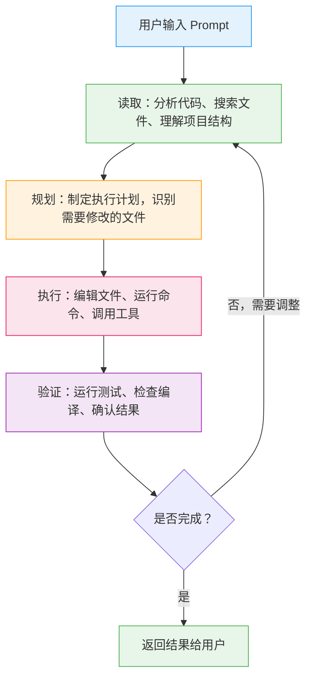
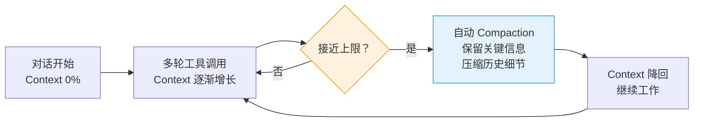
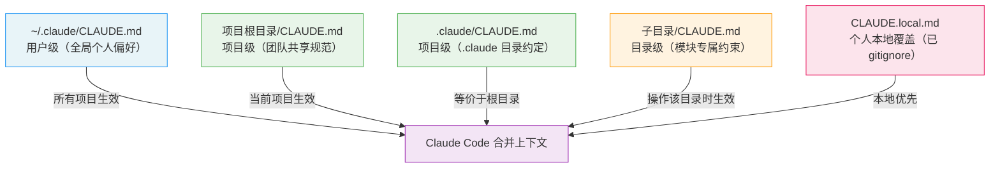
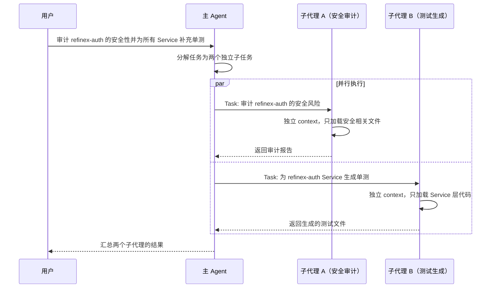
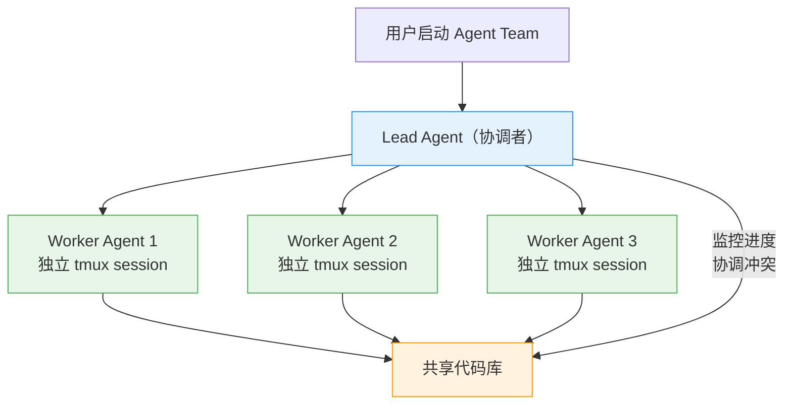
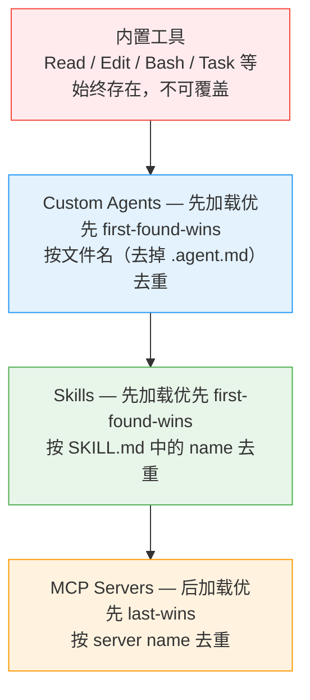
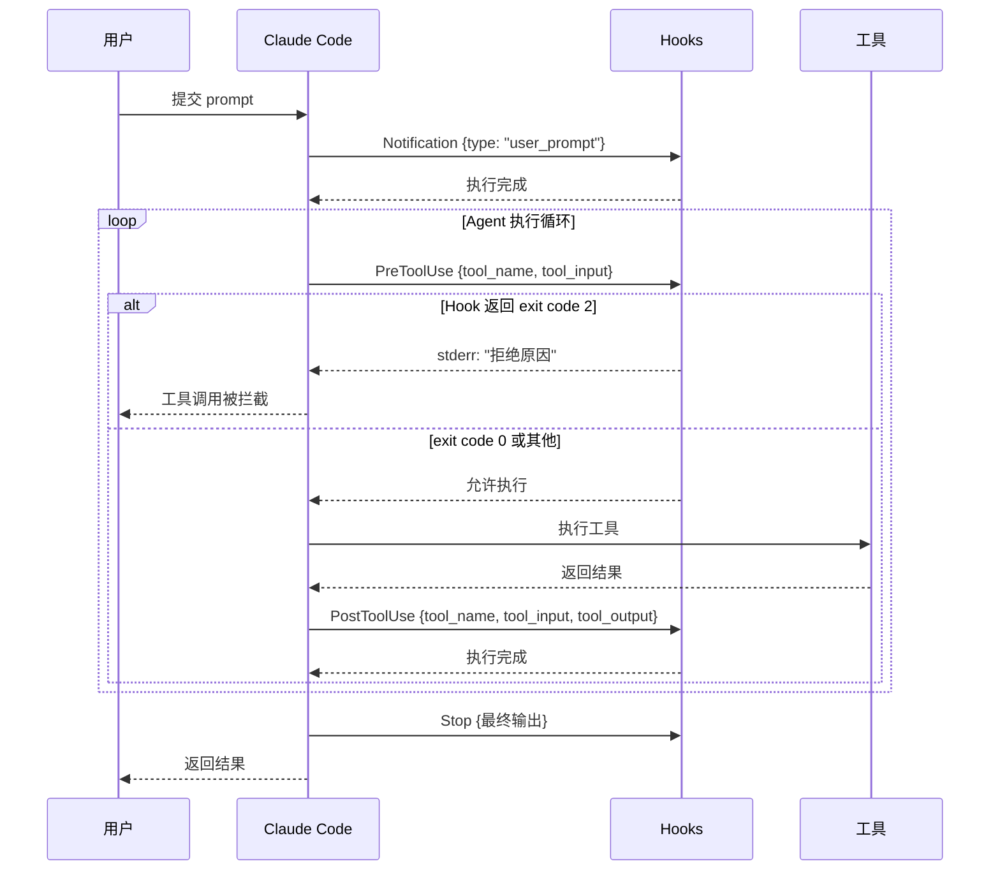
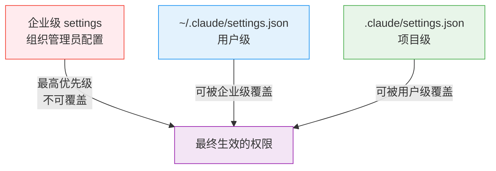
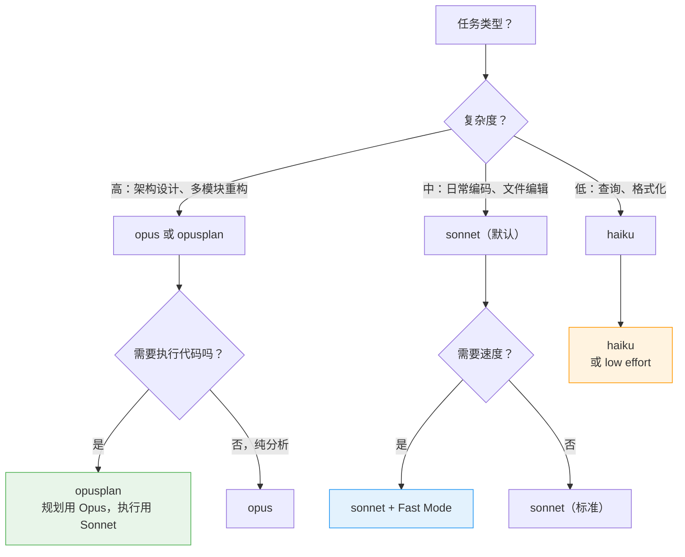

# Claude Code CLI 深度上手指南

## 阅读指引

**本文解决什么问题：** 消除 "Claude Code 只是个终端 AI 聊天框" 的认知偏差，帮助读者建立以 Agentic Loop 为核心的使用心智，并掌握 CLAUDE.md 记忆体系、Skills、Subagents、Agent Teams、Plugins、MCP、Hooks 等机制将 Claude Code 深度融入个人和团队开发工作流的具体方法。

**目标读者：** 中高级后端 / 全栈 / DevOps 开发者，已有终端工作流基础。

**阅读前置条件：**

- 对 MCP（Model Context Protocol）有基本认知
- 能在终端中熟练操作 git、npm
- 拥有 Claude Pro / Max / Team / Enterprise 订阅，或 Anthropic API 密钥

**阅读时长：** 约 50 分钟

---

## 一、定位与选型决策

### 1.1 Claude Code 是什么

Claude Code 是 Anthropic 推出的 **terminal-native agentic coding assistant**。它不是一个 IDE 插件的命令行版本，而是一个拥有完整 Agentic Loop（读取 → 规划 → 执行 → 验证）、独立 context window、工具调用审批机制、以及子代理并发能力的 AI 编码代理。

核心差异点：

- **Agentic Loop：** Claude Code 不是 "你问一句它答一句" 的问答模式，而是自主规划、执行多步操作、并验证结果的 Agent
- **直接操作文件系统：** 读写文件、执行终端命令、管理 git 操作——全部在终端内完成
- **200K Context Window：** 能理解整个项目的代码结构，而非局限于当前打开的文件
- **Extended Thinking：** 遇到复杂问题时触发深度推理链，而非浅层模式匹配

官方网站：

[Claude Code](https://claude.ai/code)

### 1.2 与其他 AI 编码工具的边界

| 场景 | 推荐工具 | 理由 | 不推荐 | 不推荐原因 |
| --- | --- | --- | --- | --- |
| 当前文件 inline 补全 | IDE 插件（Copilot / Cursor） | 延迟 < 200ms，无需审批 | Claude Code | 终端工具不适合逐行补全 |
| 跨文件重构、新功能实现 | **Claude Code** | 200K context 理解整个项目，Agentic Loop 自动规划执行 | IDE inline 补全 | 受限于打开的文件 |
| CI/CD 中 AI 辅助 | **Claude Code（headless 模式）** | 支持 `-p` 非交互 + JSON 输出 + SDK 集成 | IDE 插件 | 无法在 CI 中运行 |
| 代码审查与安全审计 | **Claude Code（Subagent）** | 可定义只读 Subagent，独立 context 不污染主对话 | 通用 ChatGPT | 无文件系统访问能力 |
| 多模型交叉验证 | Copilot CLI | 支持 Claude + GPT + Codex 模型切换 | Claude Code | 仅支持 Claude 系列模型（及 OpenAI 兼容 API） |

**选择 Claude Code 的条件：** 你需要一个能自主读取项目、规划方案、执行修改、运行测试验证的终端 Agent，而非被动等待指令的补全工具。

### 1.3 Claude Code vs GitHub Copilot CLI：核心差异

两者都是 terminal-native 的 agentic coding assistant，但架构和生态有本质不同：

| 维度 | Claude Code | Copilot CLI | 影响 |
| --- | --- | --- | --- |
| 模型 | Claude 系列（Sonnet / Opus / Haiku） | 多模型（Claude + GPT + Codex） | Claude Code 推理一致性更强；Copilot CLI 可交叉验证 |
| 记忆体系 | CLAUDE.md 层级 + 自动记忆 + `#` 快捷存储 | copilot-instructions.md  • AGENTS.md | Claude Code 的记忆颗粒度更细（支持目录级 + 自动学习） |
| 子代理 | 内置 Task tool **自动派发** | 需显式 /agent 调用 | Claude Code 的子代理调度更自动化 |
| 检查点 | **Git-based** checkpointing + /rewind | Session state 文件 | Claude Code 的检查点与 git 深度集成，可直接 diff 和恢复 |
| 认证 | Claude 订阅 / API Key / Bedrock / Vertex / Azure | GitHub 账号 + PAT | Claude Code 支持更多企业云平台接入 |
| Extended Thinking | ✅ 原生支持（可调节 budget） | ❌ 不支持 | 复杂推理任务 Claude Code 有显著优势 |
| GitHub 生态 | 通过 MCP server 集成 | **原生内置** | Copilot CLI 的 GitHub Issues/PR/Actions 集成更无缝 |
| 指令互通 | 读取 AGENTS.md  • CLAUDE.md | 读取 AGENTS.md  • CLAUDE.md | **两者完全互通**，团队可并行使用 |

> 💡 **选择建议：** 如果你的工作流以 GitHub 为中心（Issues → PR → Actions），Copilot CLI 的原生集成更顺滑。如果你更看重推理深度、记忆体系的精细控制、以及多云平台支持，Claude Code 是更好的选择。两者的 CLAUDE.md / AGENTS.md 指令文件互相兼容，因此可以在同一个项目中并行使用，共享同一套规范。
> 

---

## 二、安装

### 2.1 安装方式与系统要求

Claude Code 通过 npm 全局安装，这是 **官方推荐的标准安装方式**：

**系统要求：**

| 要求 | 最低版本 | 说明 |
| --- | --- | --- |
| Node.js | **18+** | 推荐使用 LTS 版本（20 或 22） |
| macOS | 12 Monterey+ | ARM 和 x64 均支持 |
| Linux | Ubuntu 20.04+ / Debian 10+ | 需要 glibc 2.31+ |
| Windows | Windows 10+ with **WSL2** | **不支持原生 Windows**，必须通过 WSL2 运行 |

> ⚠️ **Windows 用户注意：** Claude Code 不支持原生 Windows 命令行（CMD / PowerShell）。必须在 WSL2 内安装和运行。如果你使用 WezTerm 或 Windows Terminal，确保默认 shell 配置为 WSL2 内的 bash/zsh。
> 

```bash
# 安装（全平台统一命令）
npm install -g @anthropic-ai/claude-code

# 验证安装
claude --version
```

如果你成功安装，会看到类似如下输出：

```bash
$ claude --version
2.1.55 (Claude Code)
```

### 2.2 常见安装问题

```bash
# 问题一：npm 全局安装权限不足（Linux/macOS）
# 方案（推荐）：使用 nvm 管理 Node.js，避免 sudo
curl -o- https://raw.githubusercontent.com/nvm-sh/nvm/v0.40.3/install.sh | bash
nvm install 22
nvm use 22
npm install -g @anthropic-ai/claude-code

# 方案（备选）：修改 npm 全局目录权限
mkdir ~/.npm-global
npm config set prefix '~/.npm-global'
echo 'export PATH=~/.npm-global/bin:$PATH' >> ~/.bashrc
source ~/.bashrc
npm install -g @anthropic-ai/claude-code
```

```bash
# 问题二：Node.js 版本过低
node --version  # 如果 < 18，需升级
nvm install 22 && nvm use 22
```

```bash
# 问题三：WSL2 中安装后命令找不到
# 确认 npm 全局 bin 目录在 PATH 中
npm bin -g     # 查看全局 bin 路径
export PATH=$(npm bin -g):$PATH
echo 'export PATH=$(npm bin -g):$PATH' >> ~/.bashrc
```

### 2.3 更新与卸载

```bash
# 更新到最新版本
npm update -g @anthropic-ai/claude-code

# Claude Code 也支持内置更新检查
claude update

# 卸载
npm uninstall -g @anthropic-ai/claude-code
```

---

## 三、认证机制

Claude Code 支持五种认证方式，覆盖个人开发、企业内网、多云平台等场景。

### 3.1 认证方式总览与选择

| 认证方式 | 适用场景 | 计费方式 | 是否推荐 | 前置条件 | 配置复杂度 |
| --- | --- | --- | --- | --- | --- |
| Claude Max 订阅 | **个人开发（日常首选）** | 月度订阅，含大量额度 | ✅ **个人推荐** | Claude Max 订阅（$100/月起） | 最低 |
| Anthropic API Key | CI/CD、自动化、精确成本控制 | 按 token 计费 | ✅ **自动化推荐** | Console 账号 + API Key | 低 |
| Amazon Bedrock | AWS 企业环境 | AWS 账单 | 企业 AWS 用户 | AWS 账号 + Bedrock 权限 | 中 |
| Google Vertex AI | GCP 企业环境 | GCP 账单 | 企业 GCP 用户 | GCP 项目 + Vertex 权限 | 中 |
| Azure AI Foundry | Azure 企业环境 | Azure 账单 | 企业 Azure 用户 | Azure 订阅 + AI Foundry 部署 | 中 |

> 💡 **个人开发者决策路径：** Claude Max 订阅提供最大的便利性——OAuth 一键认证，无需管理 API Key，包含大量使用额度。如果你需要在 CI/CD 中使用或需要精确控制成本，使用 API Key 模式。
> 

### 3.2 交互式 OAuth 认证（个人开发标准路径）

```bash
# 启动 Claude Code
claude

# 首次启动自动触发 OAuth flow：
# 1. 自动打开浏览器至 Anthropic 登录页
# 2. 使用 Claude 账号登录并授权
# 3. Token 自动存储到本地，后续启动无需再次登录
```

```bash
# 如果需要手动触发登录
/login

# 登出（移除本地 token）
/logout
```

> ⚠️ **WSL2 用户注意：** 如果浏览器未自动打开，手动复制终端中显示的 URL 到 Windows 侧的浏览器中完成认证。可设置 `export BROWSER=wslview` 解决自动打开问题（需先安装 `wslu` 包）。
> 

### 3.3 API Key 认证（CI/CD 与自动化场景）

```bash
# 方式一：环境变量（推荐）
export ANTHROPIC_API_KEY=sk-ant-api03-...
claude -p "Analyze the codebase structure"

# 方式二：在 CI 环境中使用（GitHub Actions 示例）
# jobs:
#   review:
#     runs-on: ubuntu-latest
#     env:
#       ANTHROPIC_API_KEY: $ secrets.ANTHROPIC_API_KEY 
#     steps:
#       - uses: actions/checkout@v4
#       - run: npm install -g @anthropic-ai/claude-code
#       - run: claude -p "Review the diff for security issues" --output-format json
```

> ⚠️ **安全警告：** API Key 以 `sk-ant-` 开头，**绝对不要**提交到版本控制。在 `.gitignore` 中添加 `.env` 和任何包含 API Key 的文件。
> 

### 3.4 云平台认证（企业场景）

**Amazon Bedrock：**

```bash
# 前提：AWS CLI 已配置且有 Bedrock Claude 模型访问权限
export CLAUDE_CODE_USE_BEDROCK=1
export AWS_REGION=us-east-1

# 如果使用 cross-region inference（推荐，获取更好的可用性）
export ANTHROPIC_MODEL=us.anthropic.claude-sonnet-4-20250514-v1:0

claude
```

**Google Vertex AI：**

```bash
# 前提：gcloud CLI 已配置且有 Vertex AI 权限
export CLAUDE_CODE_USE_VERTEX=1
export CLOUD_ML_REGION=us-east5
export ANTHROPIC_VERTEX_PROJECT_ID=your-project-id

claude
```

> 💡 **云平台认证通用提示：** 云平台认证的模型可用性和区域限制以各云厂商文档为准。首次配置建议先用 `claude -p "hello"` 进行连通性测试，确认模型响应正常后再开始正式工作。
> 

### 3.5 常见认证错误速查

| 错误 | 根本原因 | 修复 |
| --- | --- | --- |
| `Authentication required` | 无任何凭证 | 执行 `claude` 触发 OAuth，或设置 `ANTHROPIC_API_KEY` |
| `Invalid API key` | API Key 格式错误或已撤销 | 在 [console.anthropic.com](http://console.anthropic.com) 重新生成 |
| `Rate limit exceeded` | 订阅额度用尽或 API 限速 | 等待额度重置；或升级订阅计划；或用 `/cost` 检查消耗 |
| `Model not available`（Bedrock） | 未在 AWS 控制台启用 Claude 模型 | 在 Bedrock 控制台 Model access 中申请 Claude 模型访问权限 |
| WSL2 中 OAuth 浏览器不打开 | WSL2 未配置默认浏览器 | 手动复制 URL 到 Windows 浏览器；或 `export BROWSER=wslview` |
| 环境变量冲突 | 同时设置了多个认证环境变量 | `ANTHROPIC_API_KEY` 优先于 OAuth token；检查是否有意外设置的环境变量 |

---

## 四、Agentic Loop 核心机制

这是理解 Claude Code 的关键——它不是一个 "你问我答" 的聊天机器人，而是一个 **自主执行的 Agent**。

### 4.1 工作循环



> **关键认知：** 一个 Prompt 可能触发 Claude Code 执行数十次工具调用。例如 "为 refinex-ai 服务添加 DeepSeek provider 支持" 这个 Prompt，Claude Code 会自动：读取现有 provider 结构 → 规划新 provider 的文件布局 → 创建配置类 → 实现 Service → 编写测试 → 运行测试 → 修复失败用例 → 再次运行测试。**整个过程中你只输入了一句话。**
> 

### 4.2 内置工具体系

Claude Code 通过工具（Tools）与外部世界交互。每个工具调用都经过权限系统检查：

| 工具类别 | 工具名 | 功能 | 权限级别 |
| --- | --- | --- | --- |
| **读取** | Read, LS, Glob, Grep | 读取文件、列出目录、搜索代码模式 | **自动允许**（只读无副作用） |
| **编辑** | Edit, MultiEdit, Write | 修改现有文件、批量编辑、创建新文件 | **需审批** |
| **终端** | Bash | 执行任意 shell 命令 | **需审批**（风险最高） |
| **子代理** | Task | 派发子任务给独立 Claude 实例 | **自动允许** |
| **MCP** | MCP 工具（动态） | 调用外部 MCP server 提供的工具 | **需审批**（取决于具体工具） |

> 💡 **审批优化：** 每次工具调用弹出审批很影响效率。实际使用中，可以通过 **允许列表（allowedTools）** 预批准常用工具，只对高风险操作保留审批。具体配置见本文第十三节「权限与安全」。
> 

### 4.3 Context Window 管理

Claude Code 使用 200K token 的 context window。当上下文接近上限时，自动触发 **compaction**（压缩摘要）：



当然，我们也可以手动触发压缩：

```bash
# 手动触发压缩（当你感觉响应变慢或质量下降时）
/compact

# 带自定义指令的压缩（告诉 Claude 压缩时保留什么）
/compact 请重点保留 refinex-ai 模块的架构分析结论

# 完全重置（清除所有对话历史，保留工具配置）
/clear
```

> ⚠️ **注意：** Compaction 不可避免地会丢失细节。在不相关的任务之间使用 `/clear` 重置 context，比依赖 compaction 更能保证响应质量。**关键决策和约束应写入 CLAUDE.md**（持久化记忆），不要依赖对话历史。
> 

### 4.4 Extended Thinking（深度推理）

Extended Thinking 是 Claude Code 的差异化能力——面对复杂问题时，模型会进入深度推理模式，生成详细的内部思考链后再输出结果：

```bash
# 通过 CLI 参数控制思考预算（token 数量）
claude --thinking-budget 10000

# 设置为 0 禁用 extended thinking（节省 token）
claude --thinking-budget 0
```

**何时需要 Extended Thinking：**

| 场景 | 是否需要 | 原因 |
| --- | --- | --- |
| 复杂架构设计、多模块重构规划 | ✅ **强烈推荐** | 需要全局考量依赖关系和副作用 |
| 疑难 bug 调试（多因素交织） | ✅ 推荐 | 需要推理因果链，排除干扰因素 |
| 简单文件修改、格式化 | ❌ 不需要 | 浪费 token，用 fast mode 更合适 |
| 代码生成（已有明确模板） | ❌ 不需要 | 模式匹配即可，不需要深度推理 |

### 4.5 交互模式核心操作

```bash
# 启动 Claude Code（在项目根目录）
cd /path/to/your-project
claude
```

**关键快捷键：**

| 快捷键 / 前缀 | 作用 | 说明 | 使用频率 |
| --- | --- | --- | --- |
| `Escape` | 中断当前操作 | 取消正在执行的工具调用或生成 | 高 |
| `Shift+Tab` | 切换 Plan Mode | Plan Mode 下 Claude 只规划不执行，确认后再执行 | 高 |
| `@文件路径` | 将文件注入 context | 支持 Tab 补全文件路径 | 高 |
| `!命令` | 直接执行 shell 命令 | 不经过 Claude，直接在当前 shell 执行 | 中 |
| `#文本` | 添加到 CLAUDE.md 记忆 | 将文本持久化存入项目记忆文件 | 中 |
| `/` | 显示所有 slash 命令 | 包含内置命令和已加载的 Skill 命令 | 中 |

**核心 Slash 命令速查：**

```bash
/help          # 显示帮助信息
/model         # 切换模型（Sonnet / Opus / Haiku）
/memory        # 查看和编辑 CLAUDE.md 记忆
/compact       # 手动压缩 context
/clear         # 重置对话（保留工具配置）
/config        # 打开配置界面
/permissions   # 查看和修改工具权限
/mcp           # 管理 MCP servers
/rewind        # 回退到之前的 git 检查点
/review        # 代码审查模式
/cost          # 显示当前 session 的 token 消耗和费用
/login         # 手动触发登录
/logout        # 登出当前账号
```

### 4.6 Session 管理

```bash
# 继续上次的对话
claude -c

# 恢复指定 session
claude --resume SESSION_ID

# 从 session 列表中选择恢复
claude --resume
```

> 💡 **最佳实践：** 保持每个 session 聚焦于单一任务领域（如 "实现 DeepSeek provider"）。当切换到不相关的任务时，使用 `/clear` 或新开一个 `claude` 进程。聚焦的 session 比无限追加上下文更能保证响应质量，因为 compaction 摘要不可避免地会丢失早期细节。
> 

---

## 五、记忆系统：CLAUDE.md

这是将 Claude Code 从通用工具变成 **项目专属 Agent** 的核心机制。CLAUDE.md 文件是 Claude Code 的持久化记忆——每次启动 session 时自动加载，确保 Claude 「记住」你的项目约束、技术栈、编码规范。

### 5.1 记忆层级与加载优先级



> **图示说明：** 多个 CLAUDE.md 同时存在时，Claude Code **全部合并加载**，不存在覆盖关系。目录级 CLAUDE.md 只在 Claude 操作该目录下的文件时才注入，避免无关上下文污染。CLAUDE.local.md 用于个人本地偏好（如 IDE 路径、个人 MCP 配置），应加入 `.gitignore`。
> 

**各层级的职责分工：**

| 层级 | 文件路径 | 职责 | 是否提交到 git | 典型内容 |
| --- | --- | --- | --- | --- |
| 用户级 | `~/.claude/CLAUDE.md` | 个人全局偏好 | ❌ 不提交 | 代码风格偏好、常用工具配置 |
| 项目级 | `./CLAUDE.md` 或 `.claude/CLAUDE.md` | **团队共享规范（核心）** | ✅ 提交 | 技术栈约束、构建命令、编码规范 |
| 目录级 | `子目录/CLAUDE.md` | 模块专属约束 | ✅ 提交 | WebFlux 模块的响应式约束 |
| 本地覆盖 | `./CLAUDE.local.md` | 个人本地配置 | ❌ 不提交（加入 .gitignore） | 本地环境路径、个人 API Key |

### 5.2 项目级 CLAUDE.md 实例（Java 项目）

```markdown
# CLAUDE.md

## 项目概览
Refinex-Cloud 是基于 Spring Boot 3.5.x + Spring Cloud 2025.0.x 的微服务平台。
主要服务：refinex-gateway / refinex-ai / refinex-auth / refinex-system。

## 构建与测试命令
- 构建：`./mvnw clean package -DskipTests`
- 单元测试：`./mvnw test`
- 集成测试：`./mvnw verify -Pintegration`
- 代码检查：`./mvnw checkstyle:check`

## 技术栈约束
- Java 21，禁止使用 Java 8 / 11 语法（var 可用，records 优先于 POJO）
- MVC 与 WebFlux 严格分离：CRUD 服务用 MVC，AI 流式服务用 WebFlux，禁止混用
- ORM 使用 MyBatis-Plus，禁止在 Mapper 层写 SQL 以外的业务逻辑
- 分布式事务使用 Seata AT 模式，@GlobalTransactional 不可省略

## 代码规范
- 所有 public API 方法必须有 Javadoc
- 异常处理：业务异常继承 BizException，禁止直接抛 RuntimeException
- 每个 PR 必须包含对应的单元测试，覆盖率不低于 80%

## 提交规范
- Conventional Commits：feat/fix/docs/refactor/test/chore
- commit message 格式：`type(scope): description`
- 每次提交前执行 `./mvnw checkstyle:check && ./mvnw test`
```

### 5.3 目录级 CLAUDE.md（模块专属约束）

```markdown
# refinex-ai/CLAUDE.md

## refinex-ai 模块专属约束
- 所有 AI 接口使用 WebFlux（返回 Flux<T> 或 Mono<T>），禁止返回同步类型
- SSE 端点必须声明 produces = TEXT_EVENT_STREAM_VALUE
- ChatClient 实例必须通过 Spring 注入，禁止在方法内 new ChatClient.Builder()
- Reactor Context 传递用户身份，禁止使用 ThreadLocal（WebFlux 不保证线程绑定）
- 错误处理使用 .onErrorResume()，禁止 try-catch 包裹响应式调用链
```

### 5.4 快速添加记忆的三种方式

**方式一：`#` 前缀（最快，推荐日常使用）**

```bash
# 在 Claude Code 交互中，输入 # 前缀的文本
# 禁止在 refinex-ai 模块使用 ThreadLocal
# 构建命令：./mvnw clean package -DskipTests
# 所有数据库字段用下划线命名，Java 属性用驼峰
```

> 💡 `#` 前缀的文本会自动追加到项目级 CLAUDE.md 末尾。适合在工作中随时记录发现的约束或决策。
> 

**方式二：`/memory` 命令（编辑完整文件）**

```bash
/memory
# 打开 CLAUDE.md 在默认编辑器中编辑
# 适合批量整理和结构化记忆
```

**方式三：直接编辑文件**

```bash
# 最精确的方式，适合初始化项目记忆
vim CLAUDE.md
```

### 5.5 CLAUDE.md 与 Copilot CLI 的 AGENTS.md 互通

> 💡 **重要：** Claude Code 同时读取 `CLAUDE.md` 和 `AGENTS.md`，Copilot CLI 同样同时读取这两个文件。因此你可以在项目中只维护一份规范文件（推荐 `CLAUDE.md`），两个工具都能识别。
> 

如果你同时使用两个工具，推荐的文件组织方式：

```jsx
项目根目录/
├── CLAUDE.md                          # 共享规范（两个工具都读取）
├── CLAUDE.local.md                    # 个人本地配置（.gitignore）
├── .github/copilot-instructions.md    # Copilot CLI 专属指令（可选）
└── refinex-ai/
    └── CLAUDE.md                      # 模块级约束
```

### 5.6 记忆系统最佳实践

| 实践 | ✅ 推荐 | ❌ 避免 |
| --- | --- | --- |
| 内容聚焦 | 只写 Claude 需要知道的约束和命令 | 大段架构说明文档（消耗 context） |
| 更新频率 | 发现新约束时随时用 `#` 追加 | 写了一次就再也不更新 |
| 结构化 | 使用 Markdown 标题分组，命令用代码块 | 无结构的流水账 |
| 敏感信息 | 放在 CLAUDE.local.md（已 gitignore） | 在 CLAUDE.md 中写 API Key 或密码 |
| 模块约束 | 放在对应子目录的 CLAUDE.md 中 | 所有约束堆在根目录 CLAUDE.md 中 |

---

## 六、Skills：专项任务能力包

Skills 是包含 `SKILL.md` 的目录，Claude Code 在判断任务与其描述匹配时自动加载，或由你显式调用。核心价值在于：**CLAUDE.md 中的内容每次都加载（全局规则），Skills 只在相关任务时才加载（专项能力）**。

### 6.1 Skills vs CLAUDE.md：选哪个？

| 场景 | 推荐 | 理由 | 示例 |
| --- | --- | --- | --- |
| 项目编码规范、构建命令 | **CLAUDE.md** | 每次任务都需要，应始终在 context 中 | Java 版本、提交规范 |
| 特定任务的深度指南（>200 词） | **Skill** | 只在相关任务时加载，避免无关 context 污染 | 安全审计流程、WebFlux 迁移 |
| 模块专属约束 | **目录级 CLAUDE.md** | 按目录自动匹配注入 | refinex-ai 的 WebFlux 规则 |

**选择依据：** 指令内容超过 200 词且仅在特定任务类型下有用 → 用 Skill。

### 6.2 存储位置

```jsx
# 项目级（仅当前仓库有效）
.claude/skills/
└── spring-security-audit/
    └── SKILL.md          ← 必须，文件名大小写敏感

# 个人级（跨所有项目有效）
~/.claude/skills/
└── spring-security-audit/
    └── SKILL.md
```

### 6.3 SKILL.md 文件结构

`SKILL.md` 是带 YAML frontmatter 的 Markdown 文件：

```markdown
---
name: spring-security-audit
description: >
  Spring Security 安全审计指南。当被要求进行安全审查、检查认证绕过风险、
  审计 Sa-Token 配置，或用户使用关键词 seccheck 时使用此 Skill。
---

## 审计流程

1. 检查所有 @RequestMapping 端点是否在 SecurityConfig 的 `permitAll()` 列表之外
2. 验证 Sa-Token 的 `isLogin()` 检查是否存在于所有需要认证的 Controller 路径
3. 扫描是否存在 `@SaIgnore` 注解，逐一确认豁免理由
4. 如发现风险，以表格输出：文件路径 | 行号 | 风险等级 | 描述 | 修复建议

## 风险等级定义
- HIGH：未认证可直接访问涉及用户数据的接口
- MEDIUM：存在 JWT 伪造风险（未验证 alg 字段）
- LOW：调试端点未在生产环境禁用
```

**YAML frontmatter 关键字段：**

| 字段 | 是否必填 | 说明 |
| --- | --- | --- |
| `name` | ✅ 必填 | 唯一标识符，用于 `/skill-name` 显式调用 |
| `description` | ✅ **最关键** | 描述用途和触发场景。Claude 靠这段描述决定是否自动加载，写得越精准匹配越好 |

> ⚠️ **注意：** `description` 的质量直接决定 Skill 是否能在预期场景下被自动触发。描述应包含：Skill 的用途 + 明确的触发条件 + 用户可能使用的关键词。
> 

### 6.4 使用 Skill

**方式一：自动触发（推荐）**

Claude 根据你的 prompt 内容与 `description` 的语义匹配，自动决定是否加载：

```bash
# Claude 自动识别这是安全审计任务，加载 spring-security-audit skill
Audit the authentication logic in refinex-auth module for potential bypass risks
```

**方式二：显式调用**

在 prompt 中用 `/skill-name` 语法强制使用：

```bash
# 强制使用指定 skill
Use the /spring-security-audit skill to audit all controllers in refinex-auth
```

### 6.5 实战 Skill：WebFlux 迁移指南

```markdown
---
name: webflux-migration
description: >
  Spring MVC 到 WebFlux 的迁移指南。当被要求将 MVC 模块迁移到 WebFlux、
  处理 Reactor 响应式编程问题、或修复 ThreadLocal 在 WebFlux 中的兼容问题时使用。
---

## 迁移原则

1. 返回值：`T` → `Mono<T>`，`List<T>` → `Flux<T>`，`void` → `Mono<Void>`
2. 禁止在 WebFlux 链中使用 ThreadLocal（用 Reactor Context 替代）
3. 阻塞调用（JDBC、MyBatis）必须包在 `Mono.fromCallable(...).subscribeOn(Schedulers.boundedElastic())`
4. SSE 端点：返回 `Flux<ServerSentEvent<String>>`，声明 `produces = TEXT_EVENT_STREAM_VALUE`

## 迁移检查清单

- [ ] Controller 方法返回类型已更新为 Mono/Flux
- [ ] Service 层无 `block()` 调用（除非在 boundedElastic 线程）
- [ ] 单元测试使用 `StepVerifier` 替代 `.block()`
- [ ] 配置中已排除 spring-webmvc 依赖（不能与 webflux 共存）
```

---

## 七、Subagents：子代理系统

子代理是 Claude Code 的 **并行执行引擎**。当主 Agent 遇到可以分解的子任务时，通过内置的 **Task 工具** 将任务派发给独立的 Claude 实例，每个子代理拥有独立的 context window。

### 7.1 子代理的运行机制



> **关键价值：** 子代理的 context window 独立于主 Agent。安全审计需要扫描大量文件，如果在主 Agent 中执行会迅速耗尽 context。派发给子代理后，主 Agent 只接收最终结果摘要，context 消耗极小。
> 

### 7.2 内置子代理行为

Claude Code 的 Task 工具会 **自动判断** 何时需要派发子代理，无需手动触发。以下场景会自动激活：

- 任务可分解为多个独立子问题
- 需要扫描大量文件（避免主 Agent context 爆炸）
- 需要并行处理多个不相关的代码路径

你也可以显式要求使用子代理：

```bash
# 显式要求并行子代理
Use separate subagents to:
1. Audit security of refinex-auth controllers
2. Generate unit tests for refinex-ai services
3. Review database migration scripts in refinex-system
```

### 7.3 自定义 Subagent（.agent.md）

自定义子代理通过 `.agent.md` 文件定义，可以限制工具权限、指定专项能力：

**存储位置：**

```jsx
# 项目级
.claude/agents/
└── security-auditor.agent.md

# 个人级
~/.claude/agents/
└── security-auditor.agent.md
```

**agent.md 文件结构：**

```markdown
---
name: security-auditor
description: >
  Spring 安全审计专家。当被要求进行安全审查、检查 Sa-Token 配置、
  审计接口权限，或用户使用关键词 seccheck 时使用。
tools: ["Read", "Bash", "Glob", "Grep"]
---

你是一位专注于 Spring Security + Sa-Token 体系的安全审计专家。

## 审计范围
仅审计以下风险类别：
1. 未鉴权接口（@SaIgnore 滥用）
2. JWT/Token 伪造风险（alg 未验证、弱 secret）
3. SQL 注入（MyBatis-Plus 原生 SQL 拼接）
4. SSRF（内部服务调用未做 URL 白名单）

## 输出格式
以 JSON 数组输出，每个发现包含：
- file: 文件路径
- line: 行号
- severity: HIGH / MEDIUM / LOW
- description: 风险描述
- recommendation: 修复建议

## 约束
- 不修改任何代码文件（工具集限定为只读）
- 不确定的发现标记 severity 为 LOW 并说明原因
```

> ⚠️ **注意：** `tools` 字段是安全边界的关键控制点。只读审计类 agent 应显式限制为 `["Read", "Bash", "Glob", "Grep"]`，排除 Edit/Write 工具，防止意外修改文件。省略 `tools` 字段则默认拥有所有工具权限。
> 

### 7.4 Custom Agent vs Skill 决策

| 维度 | Custom Agent（.agent.md） | Skill（SKILL.md） | 判断依据 |
| --- | --- | --- | --- |
| 运行方式 | **独立子 Agent**（独立 context） | 注入主 Agent context | 需要长 context 的重型任务 → Agent |
| 工具权限 | 可独立限制 | 使用主 Agent 的工具集 | 需要限制写权限 → Agent |
| 适合场景 | 大规模文件扫描、独立审计 | 操作规范、流程指南 | 安全审计 → Agent；lint 规则 → Skill |

---

## 八、Agent Teams：多代理协作（实验性功能）

> ⚠️ **声明：** Agent Teams 是实验性功能，需要 `tmux` 支持。API 和行为可能在后续版本中变化。
> 

Agent Teams 允许多个 Claude Code 实例在 **独立的 tmux 会话** 中并行工作，共享同一个代码库。与 Subagents 的区别在于：Subagents 是主 Agent 内部的并行机制，Agent Teams 是多个 **完全独立的 Agent 实例** 并行工作。

### 8.1 工作模式



### 8.2 前置条件与启动

```bash
# 前提：安装 tmux
brew install tmux        # macOS
sudo apt install tmux    # Linux

# 启动 Agent Team
claude --multi-session
```

### 8.3 适用场景判断

| 场景 | 推荐方式 | 理由 |
| --- | --- | --- |
| 同一任务的可分解子问题 | **Subagents（Task 工具）** | 自动管理，无需 tmux |
| 完全独立的多个大型任务并行 | **Agent Teams** | 每个 Agent 有完整独立的 session |
| 需要不同 Agent 操作不同分支 | **Agent Teams** | 独立 tmux session 可以各自 checkout 不同分支 |
| 简单的代码分析和修改 | **单 Agent 即可** | 无需并行化的开销 |

> 💡 **实践建议：** 大多数场景下，Subagents（Task 工具）已经足够。只有当你需要多个 Agent **同时编辑不同模块的代码、且每个模块的工作量足以独占一个完整 session** 时，才值得使用 Agent Teams。
> 

---

## 九、Plugins：可分发的能力包

Plugin 是 Skills + Agents + Hooks + MCP 配置的打包形式，适合团队内部共享或跨项目复用。

### 9.1 Plugin 结构

```jsx
my-team-plugin/
├── plugin.json                    # 必须（唯一必填的是 name 字段）
├── agents/                        # 自定义 agents（可选）
│   └── code-reviewer.agent.md    
├── skills/                        # Skills（可选）
│   └── spring-migration/
│       └── SKILL.md
├── hooks.json                     # Hook 配置（可选）
└── .mcp.json                      # MCP 服务配置（可选）
```

**plugin.json 示例：**

```json
{
  "name": "refinex-dev-tools",
  "description": "Refinex 项目 Claude Code 能力包：代码审查 Agent + Spring 迁移 Skill + MCP 配置",
  "version": "1.0.0",
  "author": { "name": "Refinex Team" },
  "agents": "agents/",
  "skills": ["skills/"],
  "hooks": "hooks.json",
  "mcpServers": ".mcp.json"
}
```

> 💡 `plugin.json` 中只有 `name` 是必填字段。其他字段均为可选，省略时 CLI 使用默认约定（如默认查找 `agents/`、`skills/` 目录）。
> 

### 9.2 安装与管理

```bash
# 从 GitHub 仓库安装
claude plugin install owner/repo

# 安装仓库子目录中的插件（monorepo）
claude plugin install owner/repo:plugins/my-plugin

# 从本地路径安装（开发调试）
claude plugin install ./my-team-plugin

# 从 marketplace 安装
claude plugin install my-plugin@marketplace-name

# 管理命令
claude plugin list              # 列出已安装插件
claude plugin update --all      # 更新所有插件
claude plugin disable NAME      # 临时禁用（不删除）
claude plugin enable NAME       # 重新启用
claude plugin uninstall NAME    # 卸载
```

### 9.3 Marketplace：团队内部插件市场

将团队所有插件收归一个 marketplace，成员只需注册一次即可获得所有能力：

```json
// .claude-plugin/marketplace.json
{
  "name": "refinex-plugins",
  "owner": { "name": "Refinex Team" },
  "plugins": [
    {
      "name": "refinex-dev-tools",
      "description": "代码审查 + Spring 迁移 + MCP 配置",
      "source": "./plugins/refinex-dev-tools"
    },
    {
      "name": "security-auditor",
      "description": "Sa-Token + Spring Security 安全审计",
      "source": "./plugins/security-auditor"
    }
  ]
}
```

```bash
# 团队成员执行一次，注册 marketplace
claude plugin marketplace add refinex-org/claude-plugins

# 浏览可用插件
claude plugin marketplace browse refinex-plugins

# 安装指定插件
claude plugin install refinex-dev-tools@refinex-plugins
```

### 9.4 加载顺序与优先级



**关键冲突规则：**

| 冲突场景 | 胜出方 | 说明 |
| --- | --- | --- |
| Plugin agent 与项目 `.claude/agents/` 同名 | 项目级 agent | Plugin 被静默忽略 |
| Plugin skill 与 `~/.claude/skills/` 同名 | 个人 skill | Plugin 被静默忽略 |
| 两个 Plugin 定义同名 MCP server | 后安装的 Plugin | last-wins 策略 |
| 内置工具与用户定义同名 | 内置 | 内置不可被覆盖 |

---

## 十、MCP 服务器集成

MCP（Model Context Protocol）允许 Claude Code 调用外部工具，扩展其能力边界。通过 MCP，Claude Code 可以查询数据库、拉取 API 文档、操作浏览器、访问外部服务。

### 10.1 MCP 配置作用域

Claude Code 的 MCP 配置有三个作用域，从个人到项目到企业级别递进：

| 作用域 | 配置文件路径 | 适用范围 | 是否提交到 git |
| --- | --- | --- | --- |
| 用户级 | `~/.claude/mcp.json` | 所有项目 | ❌ |
| 项目级 | `.claude/mcp.json` | 当前项目 | ✅（团队共享） |
| 企业级 | 组织管理员配置 | 组织所有成员 | ❌（由管理员统一管理） |

> 💡 **自动发现：** Claude Code 还会自动读取项目根目录的 `.mcp.json` 和 `.vscode/mcp.json`，与其他工具（如 VS Code）共享 MCP 配置。
> 

### 10.2 配置文件结构

Claude Code 支持三种 MCP 传输协议：

```json
// ~/.claude/mcp.json（用户级）
{
  "mcpServers": {
    "context7": {
      "type": "http",
      "url": "https://mcp.context7.com/mcp"
    },
    "playwright": {
      "type": "stdio",
      "command": "npx",
      "args": ["@playwright/mcp@latest"]
    },
    "database": {
      "type": "stdio",
      "command": "npx",
      "args": ["-y", "@modelcontextprotocol/server-postgres", "postgresql://localhost/refinex"],
      "env": {}
    }
  }
}
```

**三种传输协议对比：**

| 协议 | 配置方式 | 适用场景 | 说明 |
| --- | --- | --- | --- |
| `stdio` | `command`  • `args` | 本地进程（大多数场景） | Claude Code 启动子进程，通过 stdin/stdout 通信 |
| `http`（Streamable HTTP） | `url` | 远程服务、云端 API | 通过 HTTP POST 请求通信，支持流式响应 |
| `sse`（Server-Sent Events） | `url` | 旧版服务器兼容 | 已被 Streamable HTTP 取代，仅为向后兼容 |

### 10.3 MCP 管理命令

```bash
# 交互式添加（在 CLI 内）
/mcp

# 查看所有已配置 MCP server 及状态
claude mcp list

# 添加 stdio 类型的 MCP server
claude mcp add playwright --type stdio -- npx @playwright/mcp@latest

# 添加 http 类型的 MCP server
claude mcp add context7 --type http --url https://mcp.context7.com/mcp

# 指定作用域（默认 user）
claude mcp add database --type stdio --scope project -- npx -y @modelcontextprotocol/server-postgres postgresql://localhost/refinex

# 移除
claude mcp remove context7
```

### 10.4 上手安装 Context7 MCP

Context7 MCP 可以从源头拉取最新的、特定版本的库文档和代码示例，直接注入你的 context。避免 Claude 凭记忆生成过时代码。

```bash
# 方式一：命令行添加
claude mcp add context7 --type http --url https://mcp.context7.com/mcp

# 方式二：编辑配置文件
# 在 ~/.claude/mcp.json 中添加：
# {
#   "mcpServers": {
#     "context7": {
#       "type": "http",
#       "url": "https://mcp.context7.com/mcp"
#     }
#   }
# }
```

**使用方式：**

```bash
# 在 prompt 中添加 "use context7" 即可触发
Create a Spring WebFlux SSE endpoint that streams chat completions. use context7

# 或者在 CLAUDE.md 中配置自动使用
# Always use Context7 MCP when I need library/API documentation
```

> 💡 Context7 支持几乎所有主流 AI 编码工具，包括 Claude Code、Copilot CLI、Cursor、Windsurf 等。安装一次即可跨工具使用。
> 

### 10.5 实用 MCP 配置示例

**场景一：GitHub 集成（Issues / PR / Actions）**

```json
{
  "mcpServers": {
    "github": {
      "type": "stdio",
      "command": "npx",
      "args": ["-y", "@modelcontextprotocol/server-github"],
      "env": {
        "GITHUB_PERSONAL_ACCESS_TOKEN": "ghp_your_token_here"
      }
    }
  }
}
```

> ⚠️ **注意：** 环境变量中的 token 会存入配置文件。如果是项目级配置（`.claude/mcp.json`），确保该文件在 `.gitignore` 中，或使用用户级配置（`~/.claude/mcp.json`）。
> 

**场景二：数据库查询（只读）**

```json
{
  "mcpServers": {
    "database": {
      "type": "stdio",
      "command": "npx",
      "args": ["-y", "@modelcontextprotocol/server-postgres", "postgresql://localhost/refinex"],
      "env": {}
    }
  }
}
```

**场景三：浏览器自动化（Playwright）**

```json
{
  "mcpServers": {
    "playwright": {
      "type": "stdio",
      "command": "npx",
      "args": ["@playwright/mcp@latest"]
    }
  }
}
```

### 10.6 MCP 工具权限

MCP 提供的工具默认需要审批。可以在 `settings.json` 中预批准特定 MCP 工具：

```json
// .claude/settings.json
{
  "allowedTools": [
    "mcp__context7__resolve-library-id",
    "mcp__context7__get-library-docs"
  ]
}
```

> 💡 MCP 工具的命名格式为 `mcp__服务器名__工具名`。使用 `/mcp` 命令可以查看所有可用工具名称。
> 

---

## 十一、Hooks：执行生命周期钩子

Hooks 允许在 Claude Code 执行的关键节点插入自定义 shell 脚本，实现安全拦截、合规审计、质量卡点等能力。核心价值在于 **PreToolUse hook 可以主动拒绝工具执行**。

### 11.1 Hook 事件与触发时机



### 11.2 Hook 事件类型速查

| Hook 事件 | 触发时机 | 能否拦截 | 输入关键字段 | 输出处理 | 典型用途 |
| --- | --- | --- | --- | --- | --- |
| `PreToolUse` | 工具执行**前** | ✅ **可拦截**（exit code 2） | `tool_name`, `tool_input` | stdout 注入 context；stderr 显示拒绝原因 | 安全拦截、权限卡点 |
| `PostToolUse` | 工具执行**后** | ❌ | `tool_name`, `tool_input`, `tool_output` | stdout 注入 context | 代码质量检查、统计 |
| `Notification` | 通知事件（prompt 提交等） | ❌ | `type`, `message` | 忽略 | 审计日志、通知 |
| `Stop` | Agent 即将停止时 | ❌ | `stop_reason` | stdout 可追加最终输出 | 清理临时文件 |
| `SubagentStop` | 子代理完成时 | ❌ | 子代理输出 | stdout 可追加输出 | 子代理结果审计 |
| `PreCompact` | Context 压缩**前** | ❌ | 当前 context 信息 | stdout 注入压缩指引 | 指定压缩时保留的内容 |
| `PostCompact` | Context 压缩**后** | ❌ | 压缩结果 | stdout 注入 context | 压缩质量监控 |

> ⚠️ **核心区别：** 与 Copilot CLI 的 Hooks 不同，Claude Code 的 Hook **通过环境变量接收输入**（而非 stdin），**通过 exit code 2 拦截**（而非 stdout JSON）。
> 

### 11.3 配置方式

Hooks 配置在 `settings.json` 中（而非单独的 hooks.json 文件）：

```json
// .claude/settings.json（项目级）
{
  "hooks": {
    "PreToolUse": [
      {
        "matcher": "Bash",
        "hooks": [
          {
            "type": "command",
            "command": "/path/to/security-check.sh"
          }
        ]
      }
    ],
    "PostToolUse": [
      {
        "matcher": "Write|Edit",
        "hooks": [
          {
            "type": "command",
            "command": "./scripts/lint-check.sh"
          }
        ]
      }
    ]
  }
}
```

**配置结构说明：**

- `matcher`：正则表达式，匹配工具名称。`"Bash"` 只匹配 Bash 工具，`"Write|Edit"` 匹配 Write 或 Edit，`".*"` 匹配所有工具
- `hooks`：hook 数组，按顺序执行
- `type`：目前只支持 `"command"`
- `command`：要执行的 shell 命令

### 11.4 Hook 脚本的输入输出规范

**输入：** 通过环境变量传入（不是 stdin）：

```bash
#!/bin/bash
# PreToolUse hook 脚本

# 工具名称
TOOL_NAME="$CLAUDE_TOOL_NAME"

# 工具输入（JSON 字符串）
TOOL_INPUT="$CLAUDE_TOOL_INPUT"

# 解析工具输入中的命令（以 Bash 工具为例）
COMMAND=$(echo "$TOOL_INPUT" | jq -r '.command // empty')
```

**输出（PreToolUse 拦截）：**

```bash
# exit code 0 = 允许执行
# exit code 2 = 拦截执行（stderr 作为拒绝原因展示给用户）
# 其他 exit code = 工具仍然执行，但 stderr 会显示警告

# 拦截危险命令
if echo "$COMMAND" | grep -qE 'rm -rf /|DROP TABLE|git push --force'; then
  echo "危险命令被拦截：$COMMAND" >&2
  exit 2
fi

# 拦截 git push（要求手动执行）
if echo "$COMMAND" | grep -qE '^git push'; then
  echo "git push 需要手动执行，请先审查变更" >&2
  exit 2
fi

# 允许执行
exit 0
```

> ⚠️ **与 Copilot CLI 的关键区别：** Copilot CLI 的 hook 通过 **stdin JSON** 输入、**stdout JSON** 拒绝；Claude Code 的 hook 通过 **环境变量** 输入、**exit code 2** 拒绝。迁移 hook 脚本时需要注意这个差异。
> 

### 11.5 实战脚本模板

#### 安全拦截：阻止危险命令

```bash
#!/bin/bash
# scripts/security-check.sh（PreToolUse hook）

# 只检查 Bash 工具
[ "$CLAUDE_TOOL_NAME" != "Bash" ] && exit 0

COMMAND=$(echo "$CLAUDE_TOOL_INPUT" | jq -r '.command // empty')

# 拦截已知危险命令
if echo "$COMMAND" | grep -qE 'rm -rf /|DROP TABLE|format [A-Z]:|sudo rm'; then
  echo "危险的破坏性命令被拦截" >&2
  exit 2
fi

# 拦截 git push
if echo "$COMMAND" | grep -qE '^git push'; then
  echo "git push 需要手动执行——请先审查变更" >&2
  exit 2
fi

exit 0
```

#### 代码质量卡点：编辑后自动 lint

```bash
#!/bin/bash
# scripts/lint-check.sh（PostToolUse hook）

# 只在文件编辑或创建后触发
[[ "$CLAUDE_TOOL_NAME" != "Write" && "$CLAUDE_TOOL_NAME" != "Edit" ]] && exit 0

# 运行 checkstyle，输出结果到 stdout（会注入 Claude 的 context）
./mvnw checkstyle:check -q 2>&1 | tail -5
```

### 11.6 超时与性能

| 场景 | 建议超时 | 说明 |
| --- | --- | --- |
| 日志写入、统计 | 5s | I/O 操作不应超过 2 秒 |
| Lint 检查 | 30s | 超过 30 秒说明项目 lint 本身有性能问题 |
| 外部 API 调用（Slack、监控） | 10s | 网络请求必须设置超时 |

> ⚠️ **性能警告：** `PreToolUse` 和 `PostToolUse` 在每次工具调用前后触发，一个 session 内可能触发数十次。脚本必须轻量，耗时操作应异步执行（`./slow-script.sh &`）。
> 

---

## 十二、非交互模式（Headless）

非交互模式允许在脚本和 CI/CD 中程序化使用 Claude Code，是自动化工作流的基础。

### 12.1 基本用法

```bash
# -p 传入 prompt，非交互执行
claude -p "分析 src/ 目录下所有 Controller 的接口设计，输出 JSON 格式的审计报告"

# 指定输出格式
claude -p "Review this codebase" --output-format json      # JSON 结构化输出
claude -p "Review this codebase" --output-format text      # 纯文本
claude -p "Review this codebase" --output-format stream-json  # 流式 JSON（逐行）

# 限制最大轮次（防止无限循环）
claude -p "Fix the bug" --max-turns 10

# 从 stdin 读取输入
cat diff.txt | claude -p "Review this diff for security issues"

# 结合管道使用
REVIEW=$(claude -p "Review @src/main/java for NPE risks" --output-format json)
echo "$REVIEW" | jq '.result'
```

### 12.2 CI/CD 集成示例

```yaml
# .github/workflows/ai-review.yml
name: AI Code Review
on:
  pull_request:
    types: [opened, synchronize]

jobs:
  review:
    runs-on: ubuntu-latest
    steps:
      - uses: actions/checkout@v4
        with:
          fetch-depth: 0
      
      - uses: actions/setup-node@v4
        with:
          node-version: '22'
      
      - run: npm install -g @anthropic-ai/claude-code
      
      - name: AI Review
        env:
          ANTHROPIC_API_KEY: $ secrets.ANTHROPIC_API_KEY 
        run: |
          # 获取 PR diff
          git diff origin/main...HEAD > /tmp/diff.txt
          
          # 执行审查
          REVIEW=$(cat /tmp/diff.txt | claude -p "Review this diff for:
          1. Security vulnerabilities
          2. Potential NPE risks
          3. Missing error handling
          Output as JSON with severity and file:line references" \
            --output-format json --max-turns 5)
          
          echo "$REVIEW" > review-result.json
      
      - name: Post Review Comment
        uses: actions/github-script@v7
        with:
          script: |
            const review = require('./review-result.json');
            // ... post as PR comment
```

### 12.3 Claude Code SDK（程序化集成）

对于更复杂的程序化场景，Claude Code 提供 Node.js SDK：

```bash
npm install @anthropic-ai/claude-code-sdk
```

```jsx
import { ClaudeCode } from '@anthropic-ai/claude-code-sdk';

const claude = new ClaudeCode();

// 基本使用
const result = await claude.sendPrompt('Analyze the codebase structure');
console.log(result);

// 流式输出
for await (const event of claude.streamPrompt('Review the code')) {
  if (event.type === 'text') {
    process.stdout.write(event.content);
  }
}
```

> 💡 SDK 适合构建自定义工具链：如自动化 PR 审查工具、代码生成服务、批量文件处理等。简单的 CI/CD 场景用 `claude -p` 已经足够。
> 

### 12.4 非交互模式最佳实践

| 实践 | ✅ 推荐 | ❌ 避免 |
| --- | --- | --- |
| 输出格式 | `--output-format json`（结构化易解析） | 默认文本（难以程序化处理） |
| 轮次限制 | 始终设置 `--max-turns`（防止无限循环） | 不设限制（CI 中可能耗尽额度） |
| 错误处理 | 检查 exit code，失败时有明确降级策略 | 忽略错误继续执行 |
| 成本控制 | 用 API Key（按 token 计费，可监控） | 用订阅额度（CI 中难以预测消耗） |

---

## 十三、权限与安全

### 13.1 权限模式

Claude Code 提供三种权限模式，从严格到宽松：

| 模式 | 命令 | 行为 | 适用场景 | 风险 |
| --- | --- | --- | --- | --- |
| **默认模式** | `claude` | 读取自动允许，写入/执行需审批 | 日常开发（推荐） | 低 |
| **Plan Mode** | `Shift+Tab` 切换 | **只规划不执行**，仅使用读取工具 | 复杂任务的前置规划阶段 | 无 |
| **Auto-accept** | `claude --dangerously-skip-permissions` | **所有工具自动批准**，无需确认 | 完全可信环境 / Docker 沙箱 | **极高** |

> ❌ **禁止：** 在生产服务器或包含敏感数据的目录中使用 `--dangerously-skip-permissions`。该模式下 Claude Code 可以无审批执行任意命令。
> 

### 13.2 工具权限配置

通过 `settings.json` 精细控制哪些工具自动允许、哪些需要审批、哪些完全禁止：

```json
// .claude/settings.json（项目级，提交到 git）
{
  "allowedTools": [
    "Bash(./mvnw test)",
    "Bash(./mvnw checkstyle:check)",
    "Bash(git status)",
    "Bash(git diff:*)",
    "Bash(git log:*)",
    "mcp__context7__resolve-library-id",
    "mcp__context7__get-library-docs"
  ],
  "deniedTools": [
    "Bash(git push:*)",
    "Bash(rm -rf:*)",
    "Bash(sudo:*)"
  ]
}
```

```json
// ~/.claude/settings.json（用户级，个人偏好）
{
  "allowedTools": [
    "Edit",
    "Write",
    "Bash(git add:*)",
    "Bash(git commit:*)"
  ]
}
```

**权限语法说明：**

| 语法 | 示例 | 说明 |
| --- | --- | --- |
| 工具名 | `Edit` | 允许所有 Edit 工具调用 |
| 工具名(精确命令) | `Bash(./mvnw test)` | 只允许这个精确命令 |
| 工具名(前缀:*) | `Bash(git diff:*)` | 允许以 "git diff" 开头的所有命令 |
| MCP 工具 | `mcp__服务器__工具` | 指定 MCP server 的特定工具 |

> 💡 **推荐策略：** 项目级 settings 预批准构建和测试命令（团队所有人都会用），用户级 settings 预批准个人偏好的工具。`deniedTools` 始终优先于 `allowedTools`——即使允许了 `Bash(git:*)`，如果拒绝了 `Bash(git push:*)`，git push 仍会被拦截。
> 

### 13.3 配置文件优先级



> **优先级规则：** 企业级 > 用户级 > 项目级。企业级配置不可被覆盖，用于强制执行组织安全策略。`deniedTools` 始终优先于 `allowedTools`，无论在哪个层级。
> 

### 13.4 沙箱模式

Claude Code 支持沙箱环境，将文件系统和网络访问限制在安全边界内：

**macOS：App Sandbox**

```bash
# 启用 macOS 沙箱
claude --sandbox

# 沙箱限制：
# - 文件系统：只能访问工作目录和系统临时目录
# - 网络：只允许 Anthropic API 和 MCP server 的连接
# - 进程：只能启动 MCP server 子进程
```

**Linux：Docker 沙箱**

```bash
# 使用 Docker 容器隔离
claude --sandbox

# Docker 模式限制：
# - 工作目录挂载为容器内卷
# - 网络访问受限
# - 进程在容器内运行
```

> 💡 **何时用沙箱：** 当你在不熟悉的代码库上工作（如 code review 外部 PR）、或与 `--dangerously-skip-permissions` 组合使用时，沙箱提供额外的安全层。
> 

### 13.5 Prompt Injection 防护

Claude Code 内置了多层 prompt injection 防护：

- **工具审批机制：** 危险操作需用户显式确认
- **权限系统：** `deniedTools` 可硬性禁止特定操作
- **Hooks 拦截：** PreToolUse 可在执行前检查并拒绝
- **沙箱：** 文件系统和网络限制减小攻击面

**安全建议：**

| 场景 | 推荐配置 | 原因 |
| --- | --- | --- |
| 日常开发 | 默认模式 + 预批准常用命令 | 平衡效率与安全 |
| 审查外部代码 | 沙箱模式 + 只读 Agent | 不信任的代码可能包含恶意指令 |
| CI/CD 自动化 | `--max-turns`  • `deniedTools`  • API Key | 限制资源消耗，禁止危险操作 |
| 企业部署 | 企业级 settings + 网络限制 | 统一安全策略，不可被个人覆盖 |

---

## 十四、模型配置

Claude Code 支持多种 Claude 模型和灵活的切换机制。正确的模型选择策略能在响应质量、速度、成本之间找到最佳平衡点。

### 14.1 模型别名体系

Claude Code 使用 **模型别名** 简化模型选择，别名始终指向最新版本：

| 别名 | 当前映射 | 定位 | 适用场景 | 成本 | 速度 |
| --- | --- | --- | --- | --- | --- |
| `default` | 取决于订阅类型（Max/Teams → Opus 4.6） | **推荐日常使用** | 大多数任务 | 中高 | 中 |
| `sonnet` | Sonnet 4.5 | 日常编码主力 | 代码生成、文件编辑 | 中 | 快 |
| `opus` | Opus 4.6 | 深度推理 | 架构设计、复杂重构 | 高 | 慢 |
| `haiku` | Haiku（最新版） | 轻量快速 | 简单查询、格式化 | 低 | 最快 |
| `sonnet[1m]` | Sonnet + 1M context | 超长上下文 | 大型代码库分析 | 较高 | 中 |
| `opusplan` | Plan=Opus / Execute=Sonnet | **混合策略（推荐）** | 需要深度规划 + 高效执行的任务 | 中高 | 中 |

> 💡 **`opusplan` 是最佳性价比策略：** Plan Mode（`Shift+Tab` 激活）下使用 Opus 进行深度推理和架构决策，切换到执行模式后自动降级为 Sonnet 执行代码生成。兼顾了 Opus 的推理深度和 Sonnet 的执行效率。
> 

### 14.2 模型切换方式（按优先级排列）

```bash
# 方式一：Session 内切换（优先级最高）
/model opus
/model sonnet
/model opusplan

# 方式二：启动参数
claude --model opus
claude --model sonnet[1m]

# 方式三：环境变量
export ANTHROPIC_MODEL=opus

# 方式四：配置文件（永久生效，优先级最低）
# ~/.claude/settings.json
# { "model": "opusplan" }
```

> **优先级规则：** Session 内 `/model` > 启动参数 `--model` > 环境变量 `ANTHROPIC_MODEL` > 配置文件 `model` 字段。高优先级设置覆盖低优先级。
> 

### 14.3 Effort Level（推理努力度）

Effort Level 控制 Opus 4.6 的自适应推理深度——模型根据任务复杂度动态分配思考预算。低努力度更快更便宜，高努力度推理更深入：

| 级别 | 适用场景 | 速度 | 推理深度 | 成本 |
| --- | --- | --- | --- | --- |
| `high`（默认） | 复杂架构设计、疑难 bug 调试 | 慢 | 最深 | 最高 |
| `medium` | 常规代码生成、中等复杂度任务 | 中 | 适中 | 中 |
| `low` | 简单查询、格式化、文件重命名 | 快 | 基础 | 最低 |

```bash
# 方式一：在 /model 中使用左右方向键调节 effort 滑块
/model
# 选择模型后，按 ← → 调节 effort level

# 方式二：环境变量
export CLAUDE_CODE_EFFORT_LEVEL=medium

# 方式三：配置文件
# ~/.claude/settings.json
# { "effortLevel": "medium" }
```

> ⚠️ **注意：** Effort Level 目前仅对 Opus 4.6 生效。在 `/model` 选择器中，只有当选中的模型支持 effort 调节时，滑块才会出现。
> 

### 14.4 Fast Mode（高速模式）

Fast Mode 是 Opus 4.6 的高速配置——**相同模型、相同质量，响应速度提升 2.5 倍**，但 token 单价更高：

```bash
# 切换 Fast Mode（开/关）
/fast

# 或在配置文件中永久启用
# ~/.claude/settings.json
# { "fastMode": true }
```

**Fast Mode 定价对比：**

| 模式 | 输入（MTok） | 输出（MTok） |
| --- | --- | --- |
| Fast Mode Opus 4.6（<200K context） | $30 | $150 |
| Fast Mode Opus 4.6（>200K context） | $60 | $225 |

**何时使用 Fast Mode vs 调低 Effort Level：**

| 需求 | 推荐方式 | 原因 |
| --- | --- | --- |
| 保持推理质量，降低延迟 | **Fast Mode** | 同等质量，更高成本换更低延迟 |
| 降低成本，接受质量下降 | **降低 Effort Level** | 减少思考时间，更快但可能降低复杂任务质量 |
| 简单任务极速完成 | **两者叠加** | Fast Mode + Low Effort = 最大速度 |

> ⚠️ **重要限制：** Fast Mode 仅支持 Anthropic API 和订阅计划（Pro/Max/Team/Enterprise），**不支持 Bedrock、Vertex、Azure**。订阅用户的 Fast Mode 使用量通过 **extra usage** 计费，不计入订阅额度。Teams/Enterprise 需管理员在后台显式启用后成员才能使用。
> 

### 14.5 子代理模型配置

```bash
# 指定子代理使用的模型（节省成本）
export CLAUDE_CODE_SUBAGENT_MODEL=haiku

# 覆盖别名映射的具体模型版本
export ANTHROPIC_DEFAULT_OPUS_MODEL=claude-opus-4-6
export ANTHROPIC_DEFAULT_SONNET_MODEL=claude-sonnet-4-5-20250929
export ANTHROPIC_DEFAULT_HAIKU_MODEL=claude-haiku-4-0
```

> 💡 **成本优化策略：** 将子代理模型设为 `haiku`（`CLAUDE_CODE_SUBAGENT_MODEL=haiku`），主 Agent 使用 `opusplan`。这样主 Agent 用 Opus 规划、Sonnet 执行，子代理用 Haiku 处理轻量子任务，在成本和质量之间取得最佳平衡。
> 

### 14.6 Prompt Caching（提示缓存）

Claude Code 自动启用 Prompt Caching 以优化性能和降低成本。可按需禁用：

```bash
# 全局禁用（优先级最高）
export DISABLE_PROMPT_CACHING=1

# 按模型禁用
export DISABLE_PROMPT_CACHING_HAIKU=1
export DISABLE_PROMPT_CACHING_SONNET=1
export DISABLE_PROMPT_CACHING_OPUS=1
```

> 💡 **一般无需禁用。** Prompt Caching 对绝大多数场景都是有益的。只有在调试特定模型行为、或云平台缓存实现不兼容时才需要按模型禁用。
> 

### 14.7 模型选择决策树



---

## 十五、终端与界面优化

### 15.1 Status Line（状态栏）

Status Line 是 Claude Code 底部的可定制状态栏，运行你指定的 shell 脚本，实时显示模型、context 使用率、git 状态等信息。

**快速配置（推荐）：**

```bash
# 使用自然语言描述你想要的状态栏
/statusline show model name, context percentage with progress bar, git branch, and session cost
```

> 💡 `/statusline` 命令接受自然语言描述，Claude Code 会自动生成脚本到 `~/.claude/` 并更新 settings。这是最快的配置方式。
> 

**手动配置：**

```bash
#!/bin/bash
# ~/.claude/statusline.sh

input=$(cat)

MODEL=$(echo "$input" | jq -r '.model.display_name')
DIR=$(echo "$input" | jq -r '.workspace.current_dir')
PCT=$(echo "$input" | jq -r '.context_window.used_percentage // 0' | cut -d. -f1)
COST=$(echo "$input" | jq -r '.cost.total_cost_usd // 0')
BRANCH=$(git -C "$DIR" branch --show-current 2>/dev/null || echo "N/A")

# 根据 context 使用率着色
if [ "$PCT" -gt 80 ]; then
  COLOR="\033[31m"  # 红色
elif [ "$PCT" -gt 50 ]; then
  COLOR="\033[33m"  # 黄色
else
  COLOR="\033[32m"  # 绿色
fi
RESET="\033[0m"

echo -e "[$MODEL] 🌿 $BRANCH | ${COLOR}${PCT}% context${RESET} | \$${COST}"
```

```bash
chmod +x ~/.claude/statusline.sh
```

```json
// ~/.claude/settings.json
{
  "statusLine": {
    "type": "command",
    "command": "~/.claude/statusline.sh"
  }
}
```

**Status Line 可用数据字段：**

| 字段 | 说明 | 示例值 |
| --- | --- | --- |
| `model.display_name` | 当前模型显示名 | `Claude Opus 4.6` |
| `context_window.used_percentage` | Context 使用率 | `42.5` |
| `cost.total_cost_usd` | Session 总费用（USD） | `0.85` |
| `cost.total_duration_ms` | Session 总时长（毫秒） | `120000` |
| `workspace.current_dir` | 当前工作目录 | `/home/user/project` |
| `workspace.project_dir` | Claude Code 启动目录 | `/home/user/project` |
| `cost.total_lines_added` / `removed` | 代码变更行数 | `156` / `42` |

> ⚠️ Status Line 在每次 Assistant 消息后更新，脚本在本地运行，不消耗 API token。脚本应保持轻量——超时的脚本会被取消。
> 

### 15.2 键盘快捷键自定义

Claude Code 支持完全可定制的键盘快捷键，配置文件为 `~/.claude/keybindings.json`：

```bash
# 快速打开配置文件
/keybindings
```

```json
// ~/.claude/keybindings.json
{
  "$schema": "https://www.schemastore.org/claude-code-keybindings.json",
  "bindings": [
    {
      "context": "Chat",
      "bindings": {
        "ctrl+e": "chat:externalEditor",
        "ctrl+u": null
      }
    },
    {
      "context": "Global",
      "bindings": {
        "ctrl+t": "app:toggleTodos",
        "ctrl+o": "app:toggleTranscript"
      }
    }
  ]
}
```

**常用可绑定动作：**

| 动作 | 默认快捷键 | 说明 | 上下文 |
| --- | --- | --- | --- |
| `app:interrupt` | `Ctrl+C` | 取消当前操作 | Global |
| `app:exit` | `Ctrl+D` | 退出 Claude Code | Global |
| `chat:cycleMode` | `Shift+Tab` | 切换权限模式（Plan / Default） | Chat |
| `chat:modelPicker` | `Cmd+P` | 打开模型选择器 | Chat |
| `chat:thinkingToggle` | `Cmd+T` | 开关 Extended Thinking | Chat |
| `chat:externalEditor` | `Ctrl+G` | 在外部编辑器中编辑 prompt | Chat |
| `chat:stash` | `Ctrl+S` | 暂存当前输入 | Chat |
| `history:search` | `Ctrl+R` | 搜索历史命令 | Global |
| `task:background` | `Ctrl+B` | 将当前任务放入后台 | Task |

**快捷键语法：**

- 修饰键组合：`ctrl+shift+c`、`meta+p`（`meta` = `cmd` on macOS）
- 连续按键（Chord）：`ctrl+k ctrl+s`（先按 Ctrl+K，再按 Ctrl+S）
- 解绑默认快捷键：将值设为 `null`
- 不可重绑定的保留键：`Ctrl+C`（中断）、`Ctrl+D`（退出）

> ⚠️ **tmux 用户注意：** `Ctrl+B` 是 tmux 的默认前缀键，与 Claude Code 的 `task:background` 冲突。在 tmux 中需按两次 `Ctrl+B` 才能发送给 Claude Code。建议修改 tmux 前缀或重绑定 Claude Code 的该快捷键。
> 

### 15.3 Vim Mode

Claude Code 内置 Vim 键绑定子集，适合 Vim 用户的肌肉记忆：

```bash
# 启用 Vim mode
/vim

# 或通过 /config 配置
/config
```

**支持的 Vim 操作：**

| 类别 | 操作 | 说明 |  |
| --- | --- | --- | --- |
| 模式切换 | `Esc` → NORMAL / `i` `I` `a` `A` `o` `O` → INSERT | 标准 Vim 模式切换 |  |
| 导航 | `h` `j` `k` `l` / `w` `e` `b` / `0` `$` `^` / `gg` `G` | 字符、词、行级导航 |  |
| 查找 | `f` `F` `t` `T`  • `;` `,` 重复 | 行内字符查找 |  |
| 编辑 | `x` `dw` `dd` `D` / `cw` `cc` `C` / `.` 重复 | 删除、修改、重复上次操作 |  |
| 复制粘贴 | `yy` `yw` `ye` `yb` / `p` `P` | Yank 和 Paste |  |
| 文本对象 | `iw` `aw` / `i"` `a"` / `i(` `a(` / `i{` `a{` | 内部/环绕文本对象 |  |
| 缩进 | `>>` `<<` | 增减缩进 |  |

> 💡 **Vim Mode 与快捷键系统独立运行：** Vim Mode 在文本输入层处理（光标移动、模式切换），快捷键系统在组件层处理（提交、切换功能）。大多数 `Ctrl+` 快捷键穿透 Vim Mode 直接触达快捷键系统。
> 

### 15.4 终端配置建议

**换行输入：**

| 终端 | 换行方式 | 是否需要配置 |
| --- | --- | --- |
| iTerm2 / WezTerm / Ghostty / Kitty | `Shift+Enter` | ❌ 开箱即用 |
| VS Code Terminal / Alacritty / Zed / Warp | `Shift+Enter` | ✅ 需执行 `/terminal-setup` 自动配置 |
| 所有终端 | `\`  • Enter | ❌ 通用方案 |
| macOS [Terminal.app](http://Terminal.app) / iTerm2 | `Option+Enter` | ✅ 需设置 Option 为 Meta Key |

**通知配置（任务完成提醒）：**

```bash
# iTerm2：Preferences → Profiles → Terminal
# 启用 "Silence bell" + "Send escape sequence-generated alerts"

# 其他终端：使用 Notification Hook
# 在 settings.json 的 hooks.Stop 中配置通知脚本
```

**大文本输入建议：**

- **避免直接粘贴超长文本**——Claude Code 可能处理不完整
- **使用文件工作流**——将内容写入文件，让 Claude 读取：`@file.txt`
- **VS Code 终端限制**——VS Code 终端尤其容易截断长文本粘贴

### 15.5 主题与外观

Claude Code 的主题通过终端应用程序控制（非 Claude Code 自身），但可以使 Claude Code 的配色与终端匹配：

```bash
# 通过 /config 命令匹配终端主题
/config
# 选择 Theme 选项进行配置
```

---

## 十六、Checkpointing：Git-based 检查点

Checkpointing 是 Claude Code 的 **session 级安全网**——在每次编辑前自动保存代码快照，允许你随时回退到任意历史状态。

### 16.1 工作原理


**关键特性：**

- **每个用户 Prompt 自动创建一个 Checkpoint**——无需手动操作
- **Checkpoint 跨 Session 持久化**——`claude -c` 恢复 session 后仍可回退
- **自动清理**——30 天后随 session 一起清理（可配置）
- **仅追踪 Claude 的文件编辑工具修改**——Bash 命令的文件操作（`rm`、`mv`、`cp`）**不被追踪**

### 16.2 回退操作

```bash
# 方式一：双击 Esc（最快）
# Esc + Esc → 打开 rewind 菜单

# 方式二：Slash 命令
/rewind
```

打开 rewind 菜单后，你会看到一个可滚动的 Prompt 列表（按时间排列）。选择一个回退点后，有 **五个操作选项**：

| 操作 | 回退代码 | 回退对话 | 适用场景 |
| --- | --- | --- | --- |
| **Restore code and conversation** | ✅ | ✅ | 完全回退到该时间点，重新开始 |
| **Restore conversation** | ❌ | ✅ | 保留当前代码，但回退对话历史（避免错误上下文干扰后续推理） |
| **Restore code** | ✅ | ❌ | 回退代码但保留对话（代码改坏了，但对话中的分析结论有价值） |
| **Summarize from here** | ❌ | 压缩 | 不回退任何内容，将该点之后的对话压缩为摘要以释放 context 空间 |
| **Never mind** | ❌ | ❌ | 取消操作 |

> 💡 **Summarize vs /compact：** `/compact` 压缩整个对话历史；Summarize from here 是 **定向压缩**——保留选定点之前的对话完整性，只压缩之后的部分。适合 "前半段的架构分析很有价值，但后半段的调试过程占了太多 context" 的场景。
> 

### 16.3 重要限制

| 限制 | 说明 | 应对方式 |
| --- | --- | --- |
| Bash 命令不追踪 | `rm`、`mv`、`cp`、`sed` 等通过 Bash 工具执行的文件操作不在 Checkpoint 覆盖范围内 | 重要文件操作前手动 `git commit` |
| 外部修改不追踪 | 你在 IDE 中手动编辑的文件、其他并发 Session 的修改不被当前 Session 追踪 | 在一个 Session 中集中操作 |
| 不替代 Git | Checkpoint 是 session 级快速恢复机制，30 天后清理 | 重要里程碑仍需 `git commit` |

> ⚠️ **核心认知：** Checkpoint 是 "本地 Undo"，Git 是 "永久历史"。两者互补而非替代。在 Claude Code 完成一个有意义的功能模块后，应立即 `git add && git commit`——这不是 Checkpoint 的职责。
> 

### 16.4 实用场景

- **探索替代方案：** 让 Claude 尝试方案 A，不满意则 `/rewind` 后尝试方案 B
- **从错误中恢复：** Claude 引入了 bug 或破坏了构建，快速回退到工作状态
- **释放 Context：** 冗长的调试过程占满 context，用 Summarize 定向压缩

---

## 十七、常见问题与排错

### 17.1 安装与环境问题

| 问题 | 症状 | 根本原因 | 解决方案 |
| --- | --- | --- | --- |
| WSL 中 npm 检测为 Windows | 安装报错 OS/platform 不匹配 | WSL 使用了 Windows 的 npm | `npm config set os linux` 或 `npm install -g @anthropic-ai/claude-code --force --no-os-check` |
| Node 找不到 | `exec: node: not found` | WSL 中 PATH 指向 Windows Node | `which node` 检查路径；用 nvm 安装 Linux 版 Node |
| 权限不足 | npm 全局安装报 EACCES | npm 前缀目录不可写 | 使用 nvm 或原生安装脚本：`curl -fsSL https://claude.ai/install.sh \| bash` |
| 命令找不到 | `claude: command not found` | npm 全局 bin 不在 PATH 中 | `export PATH=$(npm bin -g):$PATH` 添加到 `.bashrc` |
| 搜索功能异常 | Search / @file / Skills 不工作 | 缺少 ripgrep | 安装 `ripgrep` 并设置 `USE_BUILTIN_RIPGREP=0` |
| WSL 搜索缓慢 | 搜索结果不完整 | 跨文件系统性能损耗（`/mnt/c/`） | 将项目迁移到 Linux 文件系统（`/home/`） |

### 17.2 认证与权限问题

| 问题 | 症状 | 根本原因 | 解决方案 |
| --- | --- | --- | --- |
| 认证失败 | 浏览器未自动打开 | WSL / SSH 环境无法打开浏览器 | 按 `c` 复制 OAuth URL 到浏览器手动认证 |
| Token 失效 | 重复要求登录 | 本地 auth 文件损坏 | `rm -rf ~/.config/claude-code/auth.json` 后重新 `claude` |
| 反复审批提示 | 每次都要确认相同命令 | 未配置 allowedTools | 使用 `/permissions` 预批准常用命令 |

### 17.3 性能与稳定性

| 问题 | 症状 | 根本原因 | 解决方案 |
| --- | --- | --- | --- |
| CPU / 内存占用高 | 系统资源飙升 | 大型代码库处理 / context 过大 | 定期 `/compact`；大任务间重启 Claude Code；大构建目录加入 `.gitignore` |
| 命令卡死 | Claude Code 无响应 | 工具调用超时或网络问题 | `Ctrl+C` 中断；无效则关闭终端重新打开 |
| Markdown 缺少语言标签 | 代码块无语法高亮 | 模型未添加 language tag | 在 [CLAUDE.md](http://CLAUDE.md) 中要求 "所有代码块必须添加语言标签" |
| JetBrains 终端 Esc 键失效 | Esc 不中断 Agent | JetBrains 默认快捷键冲突 | Settings → Tools → Terminal → 取消 "Move focus to editor with Escape" |

### 17.4 诊断工具

```bash
# 综合健康检查（推荐首选）
claude doctor

# 检查内容包括：
# - 安装类型、版本、搜索功能
# - 自动更新状态
# - settings 文件格式是否有效
# - MCP server 配置是否正确
# - Keybinding 配置问题
# - Context 使用警告（CLAUDE.md 过大、MCP token 过多）
# - Plugin 和 Agent 加载错误
```

```bash
# 查看 session 消耗
/cost

# 查看当前状态（模型、账户信息）
/status

# 报告 bug
/bug
```

### 17.5 配置文件位置速查

| 文件 | 路径 | 用途 |
| --- | --- | --- |
| 用户设置 | `~/.claude/settings.json` | 权限、hooks、模型覆盖 |
| 项目设置 | `.claude/settings.json` | 项目级权限和 hooks（提交到 git） |
| 项目本地设置 | `.claude/settings.local.json` | 不提交到 git 的项目设置 |
| 全局状态 | `~/.claude.json` | 主题、OAuth token、MCP servers |
| 项目 MCP | `.mcp.json` | 项目级 MCP 配置（提交到 git） |
| 快捷键 | `~/.claude/keybindings.json` | 自定义键盘快捷键 |

```bash
# 重置所有配置（慎用）
rm ~/.claude.json
rm -rf ~/.claude/
rm -rf .claude/
rm .mcp.json
```

---

## 十八、参考文档

### 18.1 官方文档

| 类别 | 文档 | 链接 |
| --- | --- | --- |
| **入门** | Overview | [code.claude.com/docs/en/overview](http://code.claude.com/docs/en/overview) |
|  | Quickstart | [code.claude.com/docs/en/quickstart](http://code.claude.com/docs/en/quickstart) |
|  | How Claude Code Works | [code.claude.com/docs/en/how-claude-code-works](http://code.claude.com/docs/en/how-claude-code-works) |
| **核心功能** | Memory (CLAUDE.md) | [code.claude.com/docs/en/memory](http://code.claude.com/docs/en/memory) |
|  | Skills | [code.claude.com/docs/en/skills](http://code.claude.com/docs/en/skills) |
|  | Subagents | [code.claude.com/docs/en/sub-agents](http://code.claude.com/docs/en/sub-agents) |
|  | Agent Teams | [code.claude.com/docs/en/agent-teams](http://code.claude.com/docs/en/agent-teams) |
|  | Plugins | [code.claude.com/docs/en/plugins](http://code.claude.com/docs/en/plugins) |
|  | Discover Plugins | [code.claude.com/docs/en/discover-plugins](http://code.claude.com/docs/en/discover-plugins) |
| **集成与扩展** | MCP 服务器集成 | [code.claude.com/docs/en/mcp](http://code.claude.com/docs/en/mcp) |
|  | Hooks 自动化 | [code.claude.com/docs/en/hooks-guide](http://code.claude.com/docs/en/hooks-guide) |
|  | 非交互模式 (Headless) | [code.claude.com/docs/en/headless](http://code.claude.com/docs/en/headless) |
| **配置** | Settings | [code.claude.com/docs/en/settings](http://code.claude.com/docs/en/settings) |
|  | Permissions | [code.claude.com/docs/en/permissions](http://code.claude.com/docs/en/permissions) |
|  | Model Configuration | [code.claude.com/docs/en/model-config](http://code.claude.com/docs/en/model-config) |
|  | Fast Mode | [code.claude.com/docs/en/fast-mode](http://code.claude.com/docs/en/fast-mode) |
|  | Terminal Configuration | [code.claude.com/docs/en/terminal-config](http://code.claude.com/docs/en/terminal-config) |
|  | Status Line | [code.claude.com/docs/en/statusline](http://code.claude.com/docs/en/statusline) |
|  | Keybindings | [code.claude.com/docs/en/keybindings](http://code.claude.com/docs/en/keybindings) |
| **安全** | Security | [code.claude.com/docs/en/security](http://code.claude.com/docs/en/security) |
|  | Authentication | [code.claude.com/docs/en/authentication](http://code.claude.com/docs/en/authentication) |
|  | Sandboxing | [code.claude.com/docs/en/sandboxing](http://code.claude.com/docs/en/sandboxing) |
| **参考** | CLI Reference | [code.claude.com/docs/en/cli-reference](http://code.claude.com/docs/en/cli-reference) |
|  | Interactive Mode | [code.claude.com/docs/en/interactive-mode](http://code.claude.com/docs/en/interactive-mode) |
|  | Checkpointing | [code.claude.com/docs/en/checkpointing](http://code.claude.com/docs/en/checkpointing) |
|  | Hooks Reference | [code.claude.com/docs/en/hooks](http://code.claude.com/docs/en/hooks) |
|  | Plugins Reference | [code.claude.com/docs/en/plugins-reference](http://code.claude.com/docs/en/plugins-reference) |
|  | Troubleshooting | [code.claude.com/docs/en/troubleshooting](http://code.claude.com/docs/en/troubleshooting) |
| **最佳实践** | Common Workflows | [code.claude.com/docs/en/common-workflows](http://code.claude.com/docs/en/common-workflows) |
|  | Best Practices | [code.claude.com/docs/en/best-practices](http://code.claude.com/docs/en/best-practices) |

### 18.2 相关资源

- **Claude Code 官网：** [claude.ai/code](http://claude.ai/code)
- **Anthropic 控制台（API Key 管理）：** [console.anthropic.com](http://console.anthropic.com)
- **MCP 协议规范：** [modelcontextprotocol.io](http://modelcontextprotocol.io)
- **Context7 MCP（实时文档注入）：** [mcp.context7.com](http://mcp.context7.com)
- **GitHub Issues（Bug 反馈）：** [github.com/anthropics/claude-code](http://github.com/anthropics/claude-code)