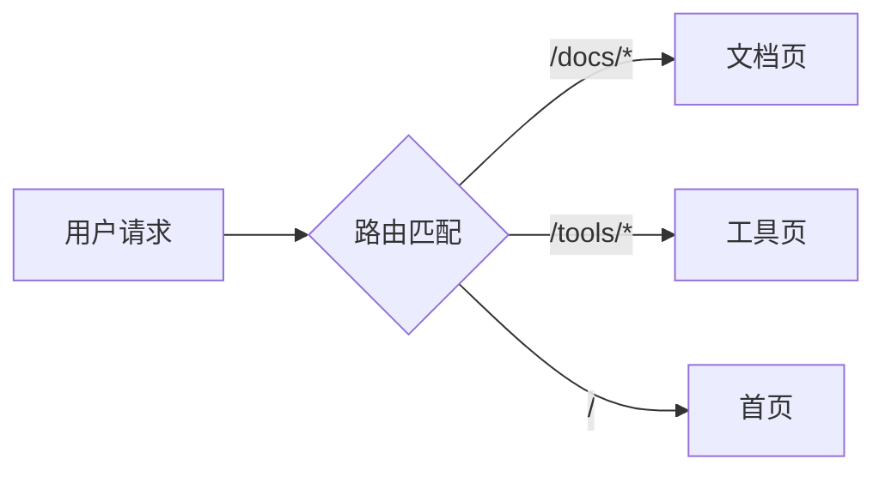

# Markdown 写作指南

本站的 `.md` 文档基于 [GFM（GitHub Flavored Markdown）](https://github.github.com/gfm/) 规范渲染，并在此基础上增强了代码块、图表和图片的能力。

## 基础语法

标准 Markdown 语法均可正常使用：标题、段落、加粗、斜体、链接、图片、引用、列表等。这里不再赘述，重点介绍增强能力。

## 表格

```markdown
| 方法 | 说明 | 返回值 |
|------|------|--------|
| `GET` | 查询资源 | 200 |
| `POST` | 创建资源 | 201 |
| `DELETE` | 删除资源 | 204 |
```

渲染效果：

| 方法 | 说明 | 返回值 |
|------|------|--------|
| `GET` | 查询资源 | 200 |
| `POST` | 创建资源 | 201 |
| `DELETE` | 删除资源 | 204 |

## 任务列表

```markdown
- [x] 支持 GFM 语法
- [x] 代码块高亮
- [ ] 待办事项
```

- [x] 支持 GFM 语法
- [x] 代码块高亮
- [ ] 待办事项

## 代码块

使用三个反引号包裹代码，并指定语言以获得语法高亮。代码块右上角自带复制按钮。

````markdown
```typescript
interface User {
  id: number;
  name: string;
  email: string;
}

const getUser = async (id: number): Promise<User> => {
  const res = await fetch(`/api/users/${id}`);
  return res.json();
};
```
````

渲染效果：

```typescript
interface User {
  id: number;
  name: string;
  email: string;
}

const getUser = async (id: number): Promise<User> => {
  const res = await fetch(`/api/users/${id}`);
  return res.json();
};
```

支持的语言包括但不限于：`typescript`、`javascript`、`java`、`python`、`go`、`rust`、`sql`、`bash`、`json`、`yaml`、`nginx`、`dockerfile` 等。

## Mermaid 图表

使用 `mermaid` 作为代码块语言，即可渲染流程图、时序图、类图等。

````markdown

````

渲染效果：


更多图表类型参考 [Mermaid 官方文档](https://mermaid.js.org/)。

## 图片

Markdown 标准图片语法即可使用。点击图片会进入图片查看器，支持缩放、旋转和自适应。

```markdown

```

## 行内代码

使用单个反引号包裹行内代码：`const x = 1`，适合在段落中引用变量名、命令或短代码片段。

## 下一步

如果你需要在文档中使用交互组件（Tabs、Steps、Callout 等），请阅读下一篇 MDX 组件指南。
