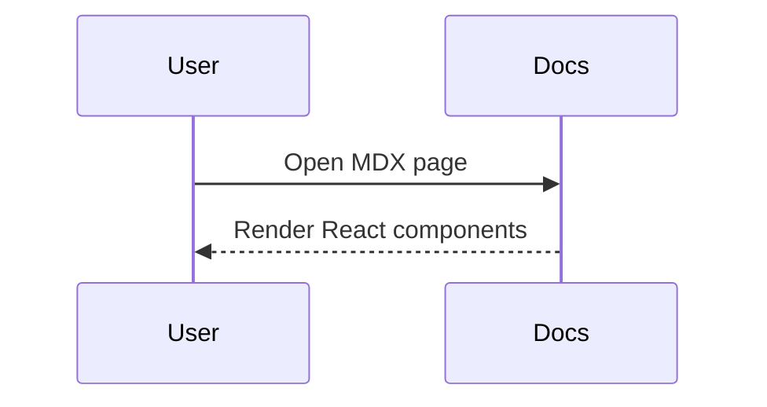

# MDX 能力演示

下面是一些“只有 MDX 才能做到”的能力：在文档里直接写 React 组件，从而拥有交互与复用能力。

<Callout type="info" title="你正在阅读的是 .mdx">
  这个页面不是 `.md`，而是 **MDX**。它会在构建阶段编译为 React 组件，然后在站点中渲染。
</Callout>

## 1) 交互式组件

你可以在文档里嵌入交互逻辑（例如按钮、状态、表单等）：

<Counter initial={2} />

## 2) 内容增强组件（更适合写技术文章）

<Callout type="tip" title="推荐">
  这些组件不是“为了炫技”，而是为了让你的技术文章更清晰、更好维护、更易读。
</Callout>

### Tabs：多语言/多版本对照

<Tabs>
  <Tab title="Java">
    ```java
    public class Hello {
      public static void main(String[] args) {
        System.out.println("Hello, World");
      }
    }
    ```
  </Tab>
  <Tab title="Kotlin">
    ```kotlin
    fun main() {
      println("Hello, World")
    }
    ```
  </Tab>
</Tabs>

### Steps：安装/部署/迁移教程必备

<Steps>
  <Step title="安装依赖">
    测试描述文本
    <Terminal>{`npm i`}</Terminal>
  </Step>
  <Step title="本地启动">
    <Terminal>{`npm run dev`}</Terminal>
  </Step>
  <Step title="构建产物">
    <Terminal>{`npm run build`}</Terminal>
  </Step>
</Steps>

### Terminal / FileTree：更像“文档”的表达

<FileTree title="project">
{`Refinex-Blog/
  content/
    Java/
      基础入门/
        基本介绍.md
  src/
    docs/
      MarkdownRenderer.tsx`}
</FileTree>

<Terminal title="bash">
{`npm i
npm run dev`}
</Terminal>

### Expandable：把“可选阅读”折叠起来

<Expandable title="展开查看：为什么要接入 MDX？" defaultOpen={false}>
  <p>
    MDX 的核心价值是让“内容”获得组件能力：你可以把常用的表达方式（Tabs、Steps、Callout、终端块等）抽象成组件，
    从而让文章结构更稳定、写作更高效、样式更统一。
  </p>
</Expandable>

### Definition / Badge / Kbd：信息密度增强

<Definition term="CSR（Client Side Rendering）">
  页面主要在浏览器端通过 JavaScript 渲染生成。
  <Badge type="info" /> <Badge type="beta" />
</Definition>

在文档中写快捷键也更清晰：<Kbd>⌘</Kbd> <Kbd>K</Kbd>

### KeyPoint / QuoteCard / Checklist：写作常用原子组件

<KeyPoint title="建议">
  如果某段话是“读完本文你最该记住的一句话”，就用 KeyPoint 把它单独提出来。
</KeyPoint>

<QuoteCard author="OpenAI Docs" source="Writing good docs">
  好的文档不是“信息更多”，而是“信息更可用”。
</QuoteCard>

<Checklist title="这套系统已支持">
  <CheckItem checked>内容目录树自动生成</CheckItem>
  <CheckItem checked>搜索（支持中文）</CheckItem>
  <CheckItem checked>MD + MDX 共存</CheckItem>
  <CheckItem>未来扩展：更多 MDX 原子组件</CheckItem>
</Checklist>

## 3) 仍然支持 Markdown 的写法

例如代码块、高亮与 Mermaid：

```ts
export const hello = (name: string) => `Hello, ${name}`;
```



<Callout type="tip" title="扩展建议">
  后续如果你希望增加更多 MDX 组件（例如 API Params 表格、对比表、运行时 Demo 等），只需要在站点里新增组件并注册到组件映射，
  然后在 MDX 中直接使用即可。
</Callout>
